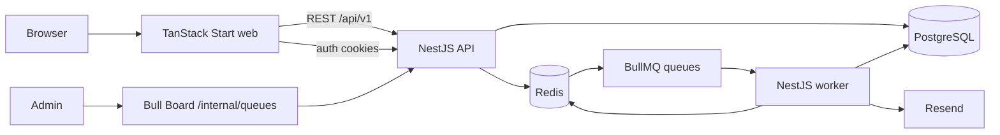
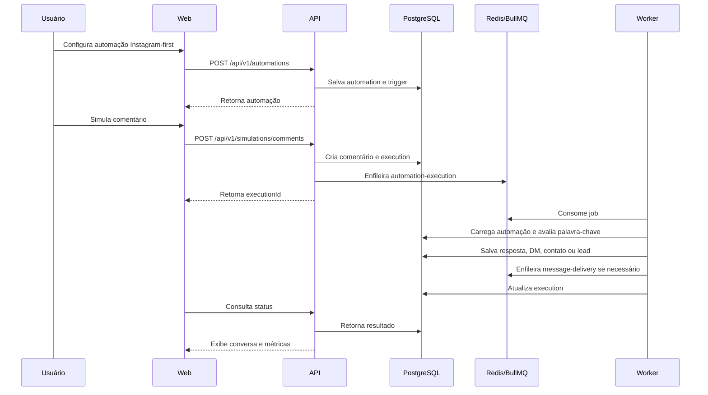

# Insta Flow — Architecture

> Status: approved 1.1  
> Approved for MVP implementation.

## 1. Visão do produto

O Insta Flow será um SaaS para criadores de conteúdo e pequenos negócios que desejam transformar interações em conversas e leads. O Instagram será o primeiro canal validado, mas não será uma dependência do núcleo do produto.

O primeiro fluxo validado pelo MVP é:

```text
comentário com palavra-chave
        ↓
resposta pública simulada
        ↓
DM simulada
        ↓
envio de link ou captura de e-mail
        ↓
tag e registro do lead
```

Na primeira versão, os eventos do Instagram serão simulados. A integração real com a Meta será adicionada posteriormente sem alterar o núcleo da automação. Outros providers poderão ser adicionados através dos mesmos contratos normalizados e adapters de canal.

## 2. Objetivos do MVP

- Validar a experiência de criação de uma automação sem Flow Builder visual.
- Validar o fluxo completo frontend → API → fila → worker → banco.
- Permitir criar automações por formulário passo a passo.
- Simular comentários, respostas públicas, DMs e captura de leads.
- Exibir automações, conversas, contatos, leads e métricas básicas.
- Estabelecer uma base Instagram-first que possa receber a integração real com Instagram e, futuramente, outros providers.

## 3. Fora do escopo inicial

- Integração real com Instagram/Meta.
- Facebook e Twitter/X reais ou múltiplos providers no MVP.
- WhatsApp, TikTok e Messenger.
- IA para criação de automações.
- Flow Builder visual.
- CRM avançado.
- Billing e planos pagos.
- Gestão avançada para agências.
- Analytics avançado e atribuição de vendas.

## 4. Vocabulário do domínio

- **Organization / Workspace**: espaço isolado de trabalho do usuário. A interface usará o termo “Workspace”, enquanto o Better Auth Organization Plugin será usado internamente.
- **Automation**: configuração reutilizável que define o gatilho e as ações executadas.
- **Trigger**: condição que inicia uma automação. No MVP, é uma palavra-chave encontrada em um comentário.
- **Action**: passo executado pela automação, como responder publicamente, enviar DM, capturar e-mail ou aplicar uma tag.
- **Execution**: uma execução individual de uma automação para um comentário recebido.
- **Lead**: contato que forneceu dados, inicialmente um endereço de e-mail.
- **Event**: fato de negócio ocorrido no sistema, como `interaction.received` ou `lead.captured`.
- **Job**: trabalho assíncrono persistido no BullMQ para ser processado por um worker.
- **Provider**: plataforma externa, como `INSTAGRAM`, `FACEBOOK` ou `TWITTER`.
- **Execution mode**: origem da operação, `SIMULATED` ou `REAL`. O modo não deve ser combinado com o provider em um único enum.
- **Channel adapter**: componente de infraestrutura que traduz payloads e chamadas de um provider para os contratos do produto.
- **Channel capability**: capacidade suportada por um provider, como receber comentários ou enviar uma mensagem direta.

## 5. Decisões arquiteturais

### 5.1 Monorepo

O projeto será um monorepo com aplicações separadas e pacotes compartilhados mínimos.

O monorepo não significa que os serviços poderão importar qualquer código entre si. As dependências serão controladas por fronteiras explícitas.

Regras:

- `web` não importa código interno de `api` ou `worker`.
- `api` não importa controllers, bootstrap ou detalhes de runtime do `worker`.
- `worker` não depende de controllers HTTP.
- `packages/contracts` não depende de NestJS, Prisma, Redis ou BullMQ.
- Código de domínio compartilhado só será extraído para um pacote quando houver necessidade real.
- Nenhuma aplicação acessa banco ou Redis da outra aplicação por chamadas internas; ambas usam seus próprios adapters e contratos.

### 5.2 API e worker

API e worker serão aplicações executáveis separadas desde o início:

```text
apps/api    → NestJS HTTP API
apps/worker → NestJS BullMQ worker
```

Isso permite deploy, restart e escala independentes, mesmo quando ambos estiverem rodando inicialmente no mesmo Docker Compose.

### 5.3 Modular monolith no backend

O backend não será dividido em microserviços no MVP. A API e o worker terão módulos orientados ao domínio, com infraestrutura isolada.

A separação futura em serviços independentes poderá ocorrer quando houver necessidade de:

- escala independente;
- deploy independente;
- equipes diferentes;
- requisitos de segurança diferentes;
- ciclos de release distintos.

### 5.4 API REST versionada

A API pública da aplicação usará REST versionada:

```text
/api/v1/auth
/api/v1/workspaces
/api/v1/automations
/api/v1/conversations
/api/v1/contacts
/api/v1/simulations
/api/v1/analytics
```

Schemas de entrada e saída serão compartilhados em `packages/contracts`, preferencialmente com Zod. Controllers não conterão regras de negócio; eles validarão a requisição e delegarão para casos de uso ou serviços de aplicação.

### 5.5 Banco de dados

PostgreSQL será a fonte oficial dos dados de produto. Prisma será usado como ORM e para migrations.

Redis não será usado como fonte de verdade para automações, leads ou conversas. Ele será usado para:

- filas BullMQ;
- cache de leituras adequadas;
- dados temporários de autenticação, quando configurado;
- locks e deduplicação de jobs, quando necessário.

### 5.6 Abstração de canal, provider e integração futura

O produto será Instagram-first, mas o núcleo MUST trabalhar com conceitos de canal, provider e modo de execução. O fluxo simulado MUST usar os mesmos contratos, casos de uso, eventos e filas que serão usados pela integração real com Instagram/Meta ou por providers futuros.

A plataforma e o modo de execução serão dimensões independentes:

```text
Provider:       INSTAGRAM | FACEBOOK | TWITTER
ExecutionMode:  SIMULATED | REAL
```

No MVP, a combinação usada será `provider=INSTAGRAM` e `mode=SIMULATED`. Uma integração real usará `provider=INSTAGRAM` e `mode=REAL`. Não serão criados valores compostos como `SIMULATED_INSTAGRAM`.

A fronteira de infraestrutura será organizada por provider:

```text
ChannelProvider
├── InstagramProvider
├── FacebookProvider (futuro)
└── TwitterProvider (futuro)
```

Cada provider poderá possuir uma implementação simulada e uma implementação real, mas essa escolha ficará fora do domínio. O núcleo da aplicação trabalhará com contratos normalizados, sem depender de payloads da Meta, Facebook ou Twitter/X:

```text
IncomingInteraction
IncomingMessage
PublicReply
PrivateReply
DirectMessage
```

O adapter deve converter payloads externos para esses contratos e converter as respostas normalizadas para o formato exigido pelo provider. Comentários, respostas, menções e outros tipos de interação são detalhes do provider e podem ser representados por `IncomingInteraction`.

Cada provider MUST declarar suas capacidades:

```text
ChannelCapabilities
├── canReceiveComments
├── canSendPublicReply
├── canSendPrivateReply
├── canSendDirectMessage
└── requiresConversationWindow
```

A publicação e a execução de uma automação devem validar essas capacidades. O núcleo não deve presumir que `PrivateReply` ou `DirectMessage` exista em todos os providers.

O simulador não poderá chamar diretamente o motor de automação. Ele deverá passar pelo mesmo caso de uso de ingestão de evento que será usado pelos webhooks dos providers:

```text
simulador ─┐
provider real ─┤→ ingestão normalizada → evento → BullMQ → worker → provider de saída
```

As ações de saída deverão declarar sua capacidade e contexto, permitindo respeitar limitações reais do canal, como resposta pública, private reply vinculada a comentário, janela de atendimento e follow-up. O simulador poderá usar respostas fictícias, mas deverá validar as mesmas regras funcionais relevantes.

Credenciais, tokens e IDs externos ficarão na camada de integração e nunca serão expostos ao domínio ou ao frontend.

## 6. Topologia de runtime



Em produção, os deployables serão:

```text
web       → TanStack Start
api       → NestJS HTTP
worker    → NestJS BullMQ processors
postgres  → PostgreSQL
redis     → Redis
```

No início, esses componentes poderão ser executados com Docker Compose. A separação lógica e os comandos de inicialização não dependerão de uma única máquina.

## 7. Organização de pastas

```text
.
├── apps/
│   ├── web/
│   │   ├── src/
│   │   │   ├── routes/
│   │   │   ├── features/
│   │   │   │   ├── dashboard/
│   │   │   │   ├── automations/
│   │   │   │   ├── conversations/
│   │   │   │   ├── contacts/
│   │   │   │   └── settings/
│   │   │   ├── components/
│   │   │   │   ├── ui/
│   │   │   │   └── layout/
│   │   │   ├── lib/
│   │   │   │   ├── api-client.ts
│   │   │   │   ├── auth-client.ts
│   │   │   │   └── query-client.ts
│   │   │   └── styles/
│   │   └── package.json
│   │
│   ├── api/
│   │   ├── src/
│   │   │   ├── main.ts
│   │   │   ├── app.module.ts
│   │   │   ├── config/
│   │   │   ├── common/
│   │   │   │   ├── guards/
│   │   │   │   ├── filters/
│   │   │   │   ├── pipes/
│   │   │   │   └── interceptors/
│   │   │   ├── infrastructure/
│   │   │   │   ├── database/
│   │   │   │   ├── redis/
│   │   │   │   ├── bullmq/
│   │   │   │   ├── email/
│   │   │   │   └── bull-board/
│   │   │   └── modules/
│   │   │       ├── auth/
│   │   │       ├── workspaces/
│   │   │       ├── automations/
│   │   │       ├── conversations/
│   │   │       ├── contacts/
│   │   │       ├── analytics/
│   │   │       └── simulation/
│   │   └── package.json
│   │
│   └── worker/
│       ├── src/
│       │   ├── main.ts
│       │   ├── worker.module.ts
│       │   ├── processors/
│       │   │   ├── automation-execution.processor.ts
│       │   │   ├── message-delivery.processor.ts
│       │   │   └── email-delivery.processor.ts
│       │   └── infrastructure/
│       │       ├── database/
│       │       └── redis/
│       └── package.json
│
├── packages/
│   └── contracts/
│       ├── src/
│       │   ├── api/
│       │   ├── events/
│       │   ├── jobs/
│       │   └── schemas/
│       └── package.json
│
├── prisma/
│   ├── schema.prisma
│   └── migrations/
├── docker-compose.yml
├── pnpm-workspace.yaml
├── package.json
├── .env.example
└── ARCHITECTURE.md
```

O template Satnaing será usado como referência e fonte de componentes visuais shadcn. A aplicação web será criada com TanStack Start; não será acoplada ao runtime Vite original do template.

## 8. Domínios e módulos

### Auth

Better Auth será a fonte de autenticação e sessões. Métodos do MVP:

- e-mail e senha;
- Google OAuth;
- confirmação de e-mail por link;
- recuperação de senha.

O Better Auth Organization Plugin será usado para representar os workspaces. A camada de aplicação encapsulará chamadas do plugin atrás de serviços próprios, evitando espalhar detalhes do Better Auth pelo domínio.

### Workspaces

O usuário poderá pertencer a uma ou mais Organizations. O primeiro acesso criará uma Organization padrão de forma idempotente. O workspace ativo virá da sessão/contexto da Organization e será validado no backend.

Toda consulta de negócio será escopada pela Organization ativa:

```text
automation.organization_id
contact.organization_id
conversation.organization_id
lead.organization_id
execution.organization_id
```

O `organization_id` enviado pelo cliente nunca será suficiente para autorizar acesso. O backend deverá verificar a sessão e a participação do usuário na Organization.

### Automations

Responsável por criar, editar, publicar, pausar e listar automações.

Modelo conceitual:

```text
Automation
 ├── AutomationTrigger
 └── AutomationAction[]
```

No MVP, uma automação terá um trigger de comentário por palavra-chave e uma sequência ordenada de ações.

### Simulation

Cria interações simuladas para validar o comportamento da automação sem depender de um provider externo. O primeiro cenário será um comentário do Instagram com `provider=INSTAGRAM` e `mode=SIMULATED`.

O simulador deverá atravessar o mesmo caminho de produção:

```text
simulação → API → job → worker → persistência → resultado exibido
```

Não haverá um segundo motor de regras apenas para a interface.

### Conversations e Contacts

Registrarão mensagens, participantes, contatos, tags e leads capturados. O modelo deve preservar provider, modo de execução e IDs externos sem obrigar o domínio a conhecer payloads específicos de cada canal.

### Analytics

Começará com consultas agregadas sobre dados persistidos:

- comentários processados;
- automações executadas;
- DMs simuladas enviadas;
- leads capturados;
- falhas de execução.

## 9. Eventos e filas

Eventos de domínio representam fatos de negócio. BullMQ executa jobs assíncronos e persistidos. Os dois conceitos não serão tratados como sinônimos.

### Eventos de domínio

```text
interaction.received
message.received
automation.execution.requested
automation.execution.completed
automation.execution.failed
message.sent
lead.captured
```

Os payloads desses eventos viverão em `packages/contracts/src/events`.

### Filas BullMQ

```text
email-delivery
automation-execution
message-delivery
analytics
```

Jobs deverão possuir:

- payload validado;
- `jobId` determinístico quando houver risco de duplicidade;
- tentativas configuradas;
- backoff exponencial para falhas transitórias;
- retenção controlada de jobs concluídos e falhos;
- logs estruturados;
- atualização de status da execução no PostgreSQL.

O envio de e-mail de confirmação, reset de senha e futuros convites do Organization Plugin passará pela fila `email-delivery`, usando Resend no processor.

## 10. Fluxo principal do MVP



## 11. Autenticação e e-mail

Better Auth usará cookies HTTP-only e será servido pelo backend. O frontend consumirá a sessão com credenciais incluídas.

Configuração conceitual:

```text
emailAndPassword.enabled = true
emailAndPassword.requireEmailVerification = true
emailVerification.sendOnSignUp = true
emailVerification.sendOnSignIn = true
socialProviders.google.requireEmailVerification = true
accountLinking.enabled = true
accountLinking.allowDifferentEmails = false
```

Resend será usado como provedor transacional. A API solicitará o envio e a fila processará a entrega, com retry.

Em produção, frontend e API deverão compartilhar uma origem pública ou usar proxy/rewrite para manter os cookies como first-party:

```text
app.example.com/            → web
app.example.com/api/*       → api
app.example.com/internal/*  → Bull Board
```

## 12. Bull Board

Bull Board ficará montado apenas na API, em uma rota interna:

```text
/internal/queues
```

Requisitos:

- autenticação obrigatória;
- autorização para role administrativa;
- acesso fora do menu comum do produto;
- `readOnlyMode` por padrão em produção;
- logs das ações administrativas;
- não expor Redis ou credenciais na interface pública.

## 13. Frontend

Stack:

- TanStack Start;
- TanStack Router;
- TanStack Query;
- shadcn/ui;
- Tailwind CSS;
- TypeScript;
- React Hook Form;
- Zod;
- Lucide Icons.

Responsabilidades:

- TanStack Query: cache, loading, invalidação e sincronização dos dados da API.
- Estado local: etapas e campos do formulário de automação.
- URL/search params: filtros e paginação que precisem ser compartilháveis.
- shadcn/ui: componentes acessíveis e consistentes.

O dashboard terá:

- métricas principais;
- lista de automações;
- criação/edição passo a passo;
- simulador de comentário e DM;
- histórico de conversas;
- contatos/leads;
- configurações do workspace.

## 14. Segurança e isolamento

- Validar todas as entradas no limite da API.
- Aplicar guards para sessão e acesso à Organization.
- Não confiar em `organization_id` vindo do cliente.
- Usar queries sempre escopadas por Organization.
- Manter segredos apenas em variáveis de ambiente.
- Nunca enviar `RESEND_API_KEY`, `GOOGLE_CLIENT_SECRET`, `BETTER_AUTH_SECRET`, `DATABASE_URL` ou `REDIS_URL` ao browser.
- Aplicar rate limiting nos endpoints de auth, simulação e envio de e-mail.
- Sanitizar conteúdo exibido em conversas simuladas.
- Não registrar tokens OAuth ou conteúdo sensível em logs.
- Configurar CORS restritivo quando web e API estiverem em origens diferentes.

## 15. Deploy e operação

### Desenvolvimento

Docker Compose fornecerá:

```text
postgres
redis
api
worker
web
```

### Produção inicial

Pode começar em uma única VPS com containers separados. O deploy deverá manter comandos independentes para `web`, `api` e `worker`.

### Evolução

Cada aplicação deverá ter:

- health check;
- graceful shutdown;
- logs estruturados;
- configuração por ambiente;
- pipeline de build separado;
- imagem Docker própria ou target próprio no build.

Apenas um processo controlado deverá executar migrations Prisma em cada release.

## 16. Testes

- Unitários: casos de uso, matching de palavra-chave e regras de execução.
- Integração: Prisma, filas e adapters externos com mocks.
- E2E API: autenticação, Organizations, automações e simulações.
- E2E web: criação de automação e visualização do resultado.
- Contratos: validação dos payloads em `packages/contracts`.
- Worker: sucesso, retry, idempotência e falha permanente.

Nenhum teste deverá depender da API real do Instagram no MVP.

## 17. Observabilidade mínima

- logs estruturados com `requestId`, `organizationId`, `userId`, `jobId` e `executionId` quando disponíveis;
- endpoint de health/readiness;
- métricas de jobs por estado;
- contagem de falhas de execução;
- Bull Board para inspeção operacional;
- tratamento centralizado de exceções na API.

## 18. Decisões adiadas

As decisões abaixo não bloqueiam o MVP:

- provedor de hospedagem;
- integração real com Meta;
- billing;
- sistema de planos e limites;
- convites e colaboração avançada;
- WebSockets ou atualização em tempo real;
- serviço externo de observabilidade;
- extração de `packages/domain`.
- catálogo definitivo de capacidades e contratos específicos de cada provider;

## 19. Ordem de implementação

1. Confirmar este documento.
2. Criar o monorepo e os três deployables.
3. Configurar PostgreSQL, Prisma, Redis e Docker Compose.
4. Configurar Better Auth, Google, confirmação de e-mail, Resend e Organization Plugin.
5. Criar contratos compartilhados.
6. Implementar automações, triggers, actions e executions.
7. Implementar filas e worker.
8. Implementar simulação completa.
9. Criar interface TanStack Start com shadcn/ui.
10. Adicionar Bull Board protegido.
11. Adicionar testes, health checks e documentação de execução.

## 20. Critério para evolução da arquitetura

A implementação do MVP está aprovada. Alterações relevantes de arquitetura deverão ser registradas neste documento antes de serem implementadas.

Uma futura migração para microserviços deverá preservar os contratos de eventos, o isolamento por domínio e a propriedade explícita das tabelas de cada contexto.
