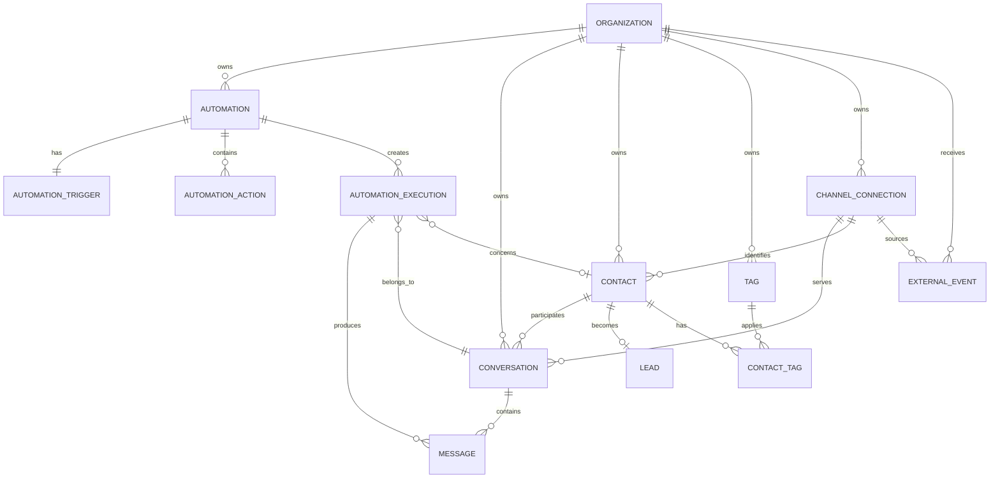

# Engancha — Modelo de Dados

> Versão: 0.2  
> Status: aprovado para implementação  
> Referências: [ARCHITECTURE.md](./ARCHITECTURE.md) · [REQUIREMENTS.md](./REQUIREMENTS.md)

## 1. Objetivo

Este documento define o modelo lógico de dados do Engancha antes da criação do `schema.prisma`.

O modelo precisa atender três objetivos ao mesmo tempo:

1. suportar o MVP simulado;
2. garantir isolamento por Organization do Better Auth;
3. permitir adicionar Instagram/Meta real e providers futuros sem reescrever automações, conversas e execuções.

## 2. Princípios

- PostgreSQL é a fonte de verdade dos dados do produto.
- Redis armazena filas, cache e dados temporários; não é fonte de verdade.
- Todas as entidades de negócio pertencem a uma `organization`.
- `organizationId` nunca é suficiente para autorizar uma operação; o membership da sessão deve ser validado.
- IDs internos serão UUIDs gerados pela aplicação/banco.
- IDs externos de providers serão armazenados separadamente dos IDs internos.
- `provider` identifica a plataforma e `mode` identifica `SIMULATED` ou `REAL`; os dois conceitos nunca serão combinados em um único enum.
- O domínio persistirá contratos normalizados; payloads e regras específicas de cada provider ficarão nos adapters de canal.
- A publicação e a execução de ações deverão respeitar as capacidades declaradas pelo provider.
- Dados de execução devem ser imutáveis depois da conclusão.
- Payloads flexíveis ficam em `Json`, mas sempre são validados por schemas Zod antes de persistir.
- As tabelas do Better Auth/Organization Plugin serão tratadas como infraestrutura de autenticação.

## 3. Separação entre autenticação e produto

### Tabelas gerenciadas pelo Better Auth

O Better Auth será responsável pelas tabelas abaixo, incluindo as tabelas adicionadas pelo Organization Plugin:

```text
user
session
account
verification
organization
member
invitation
```

Os nomes e campos finais devem ser gerados/confirmados pelo Better Auth CLI e pelo adapter Prisma. Não devemos duplicar `organization`, `member` ou `user` em tabelas próprias.

### Tabelas do produto

```text
automation
automation_trigger
automation_action
automation_execution
conversation
message
contact
lead
tag
contact_tag
external_event
channel_connection
```

`channel_connection` e `external_event` ficam preparados para o Instagram real e para providers futuros, mas podem permanecer sem uso no primeiro vertical slice.

## 4. Diagrama lógico



## 5. Entidades

### 5.1 Organization

Gerenciada pelo Better Auth Organization Plugin. Representa o workspace exibido no produto.

Campos relevantes para o domínio:

```text
id          String   PK
name        String
slug        String   UNIQUE
logo        String?
metadata    Json?
createdAt   DateTime
```

Relações:

```text
organization 1:N automation
organization 1:N conversation
organization 1:N contact
organization 1:N tag
organization 1:N channel_connection
organization 1:N external_event
```

### 5.2 Automation

Configuração reutilizável criada pelo usuário.

```text
id                    UUID       PK
organizationId        String     FK → organization.id
name                  String
status                Enum       DRAFT | ACTIVE | PAUSED | ARCHIVED
version               Int        DEFAULT 1
publishedVersion      Int?
createdByUserId       String     FK lógica → user.id
createdAt             DateTime
updatedAt             DateTime
publishedAt           DateTime?
pausedAt              DateTime?
archivedAt            DateTime?
```

Regras:

- `organizationId` é obrigatório.
- Apenas `ACTIVE` pode receber novos disparos.
- `DRAFT` pode estar incompleta.
- Publicar incrementa a versão publicada.
- Editar uma automação não altera snapshots de execuções antigas.

Índices:

```text
(organizationId, status)
(organizationId, updatedAt)
```

### 5.3 AutomationTrigger

Gatilho que inicia a automação. O MVP possui um trigger de comentário por palavra-chave por automação.

```text
id              UUID       PK
automationId    UUID       FK → automation.id
type            Enum       COMMENT_KEYWORD
keyword         String
normalizedValue String
config          Json?
createdAt       DateTime
updatedAt       DateTime
```

Regras:

- deve existir exatamente um trigger ativo por automação no MVP;
- `normalizedValue` é usado no matching;
- regra recomendada: trim + lowercase + normalização Unicode definida no código;
- a palavra original é preservada em `keyword` para exibição.

Constraint:

```text
UNIQUE (automationId, type)
```

### 5.4 AutomationAction

Ações ordenadas executadas quando o trigger corresponde.

```text
id              UUID       PK
automationId    UUID       FK → automation.id
position        Int
type            Enum       PUBLIC_REPLY | PRIVATE_REPLY | LINK | CAPTURE_EMAIL | APPLY_TAG
config          Json
createdAt       DateTime
updatedAt       DateTime
```

Exemplos de `config` validados por Zod:

```json
{
  "type": "PUBLIC_REPLY",
  "text": "Oi! Vou te enviar o material por DM."
}
```

```json
{
  "type": "PRIVATE_REPLY",
  "text": "Aqui está o material que você pediu:"
}
```

```json
{
  "type": "LINK",
  "url": "https://example.com/material",
  "label": "Abrir material"
}
```

```json
{
  "type": "CAPTURE_EMAIL",
  "prompt": "Qual é o seu melhor e-mail?"
}
```

```json
{
  "type": "APPLY_TAG",
  "tagName": "material-instagram"
}
```

Constraint:

```text
UNIQUE (automationId, position)
```

### 5.5 AutomationExecution

Uma tentativa de executar uma automação para um evento recebido.

```text
id                    UUID       PK
organizationId        String     FK → organization.id
automationId          UUID       FK → automation.id
conversationId        UUID?      FK → conversation.id
contactId             UUID?      FK → contact.id
sourceEventId         UUID?      FK → external_event.id
provider              Enum       INSTAGRAM | FACEBOOK | TWITTER
mode                  Enum       SIMULATED | REAL
sourceType            Enum       COMMENT | MESSAGE | INTERACTION
sourceExternalId      String?
automationVersion     Int
automationSnapshot    Json
status                Enum       PENDING | PROCESSING | COMPLETED | FAILED | IGNORED
matched               Boolean
errorCode             String?
errorMessage          String?
attempts              Int        DEFAULT 0
startedAt             DateTime?
completedAt           DateTime?
createdAt             DateTime
updatedAt             DateTime
```

`automationSnapshot` contém trigger e actions efetivamente usados na execução. Isso garante histórico imutável mesmo se a automação for editada depois.

Idempotência:

```text
UNIQUE (organizationId, provider, mode, sourceType, sourceExternalId)
```

Para simulações, `sourceExternalId` deve ser gerado pelo sistema ou recebido de forma controlada. O mesmo evento simulado não deve gerar duas execuções.

### 5.6 Conversation

Agrupa mensagens entre um contato e o workspace em um canal específico.

```text
id                    UUID       PK
organizationId        String     FK → organization.id
contactId             UUID?      FK → contact.id
channelConnectionId   UUID?      FK → channel_connection.id
provider              Enum       INSTAGRAM | FACEBOOK | TWITTER
mode                  Enum       SIMULATED | REAL
externalId            String?
status                Enum       OPEN | CLOSED
lastMessageAt         DateTime?
createdAt             DateTime
updatedAt             DateTime
```

Constraint futura:

```text
UNIQUE (organizationId, provider, mode, channelConnectionId, externalId)
```

`externalId` pode ser nulo para dados simulados, mas deve ser obrigatório quando uma conversa real for persistida. Para dados reais, `channelConnectionId` identifica a conta externa responsável pelo canal. Como a conexão é nula no modo simulado, a implementação deve usar índices únicos parciais ou estratégia equivalente.

### 5.7 Message

Mensagem ou resposta registrada na conversa.

```text
id                    UUID       PK
conversationId        UUID       FK → conversation.id
executionId           UUID?      FK → automation_execution.id
direction             Enum       INBOUND | OUTBOUND
type                  Enum       COMMENT | INCOMING_MESSAGE | PUBLIC_REPLY | PRIVATE_REPLY | DIRECT_MESSAGE
provider              Enum       INSTAGRAM | FACEBOOK | TWITTER
mode                  Enum       SIMULATED | REAL
externalId            String?
text                  String?
payload               Json?
status                Enum       PENDING | SENT | FAILED | RECEIVED
sentAt                DateTime?
createdAt             DateTime
```

O campo `type` diferencia uma interação recebida, uma resposta pública, uma private reply e uma DM. Essa distinção é necessária para validar as capacidades de cada provider.

### 5.8 Contact

Pessoa que interagiu com o workspace.

```text
id                    UUID       PK
organizationId        String     FK → organization.id
channelConnectionId   UUID?      FK → channel_connection.id
provider              Enum       INSTAGRAM | FACEBOOK | TWITTER
mode                  Enum       SIMULATED | REAL
externalUserId        String?
username              String?
name                  String?
email                 String?
emailNormalized       String?
metadata              Json?
createdAt             DateTime
updatedAt             DateTime
lastInteractionAt     DateTime?
```

Constraints:

```text
UNIQUE (organizationId, emailNormalized)
UNIQUE (organizationId, provider, mode, channelConnectionId, externalUserId)
```

Como alguns valores podem ser nulos, a implementação Prisma/PostgreSQL deve usar índices únicos parciais ou estratégia equivalente para não bloquear vários contatos sem e-mail/ID externo ou sem conexão simulada. Uma pessoa em providers diferentes não deve ser presumida como a mesma identidade sem uma regra explícita de unificação.

### 5.9 Lead

Marca que um contato forneceu dados e entrou no funil do workspace.

```text
id                    UUID       PK
organizationId        String     FK → organization.id
contactId             UUID       FK → contact.id
automationId          UUID?      FK → automation.id
executionId           UUID?      FK → automation_execution.id
provider              Enum       INSTAGRAM | FACEBOOK | TWITTER
mode                  Enum       SIMULATED | REAL
capturedAt            DateTime
metadata              Json?
createdAt             DateTime
updatedAt             DateTime
```

Constraint do MVP:

```text
UNIQUE (organizationId, contactId)
```

Um contato torna-se lead na primeira captura válida. Se futuramente for necessário registrar várias conversões, será criada uma tabela `lead_capture` sem quebrar o modelo atual.

### 5.10 Tag

Etiqueta pertencente ao workspace.

```text
id              UUID       PK
organizationId  String     FK → organization.id
name            String
normalizedName  String
createdAt       DateTime
updatedAt       DateTime
```

Constraint:

```text
UNIQUE (organizationId, normalizedName)
```

### 5.11 ContactTag

Relação N:N entre contatos e tags.

```text
contactId       UUID       FK → contact.id
tagId           UUID       FK → tag.id
createdAt       DateTime
```

Primary key composta:

```text
PRIMARY KEY (contactId, tagId)
```

### 5.12 ChannelConnection — futuro

Representa uma conta externa conectada ao workspace.

```text
id                    UUID       PK
organizationId        String     FK → organization.id
provider              Enum       INSTAGRAM | FACEBOOK | TWITTER
externalAccountId     String
username              String?
encryptedAccessToken  String
tokenExpiresAt        DateTime?
scopes                String[]
status                Enum       ACTIVE | EXPIRED | REVOKED | ERROR | DISCONNECTED
lastWebhookAt         DateTime?
metadata              Json?
createdAt             DateTime
updatedAt             DateTime
```

Constraints:

```text
UNIQUE (provider, externalAccountId)
UNIQUE (organizationId, provider, externalAccountId)
```

O token nunca será retornado pela API ou enviado ao frontend.

`ChannelConnection` representa uma conta externa real; por isso, sua conexão sempre usa o modo `REAL`. O modo `SIMULATED` é usado nos eventos, conversas, mensagens e contatos gerados pelo simulador, sem exigir uma conta conectada.

### 5.13 ExternalEvent — futuro

Evento recebido de um provider externo ou de um adapter simulado.

```text
id                    UUID       PK
organizationId        String     FK → organization.id
channelConnectionId   UUID?      FK → channel_connection.id
provider              Enum       INSTAGRAM | FACEBOOK | TWITTER
mode                  Enum       SIMULATED | REAL
eventType             String
externalEventId       String
externalObjectId      String?
payload               Json
receivedAt             DateTime
processedAt           DateTime?
status                Enum       RECEIVED | PROCESSING | PROCESSED | FAILED | IGNORED
errorMessage          String?
```

Constraint:

```text
UNIQUE (provider, mode, channelConnectionId, externalEventId)
```

Essa tabela é a primeira barreira de idempotência para reentregas de webhook.

## 6. Enums principais

```text
AutomationStatus:
  DRAFT
  ACTIVE
  PAUSED
  ARCHIVED

AutomationTriggerType:
  COMMENT_KEYWORD

AutomationActionType:
  PUBLIC_REPLY
  PRIVATE_REPLY
  LINK
  CAPTURE_EMAIL
  APPLY_TAG

ExecutionStatus:
  PENDING
  PROCESSING
  COMPLETED
  FAILED
  IGNORED

ConversationStatus:
  OPEN
  CLOSED

MessageDirection:
  INBOUND
  OUTBOUND

MessageType:
  COMMENT
  INCOMING_MESSAGE
  PUBLIC_REPLY
  PRIVATE_REPLY
  DIRECT_MESSAGE

MessageStatus:
  PENDING
  SENT
  FAILED
  RECEIVED

Provider:
  INSTAGRAM
  FACEBOOK
  TWITTER

ExecutionMode:
  SIMULATED
  REAL
```

### 6.1 Capacidades do canal

As capacidades são declaradas pelo adapter de cada provider. Elas não devem ser inferidas apenas pelo tipo de mensagem escolhido na automação.

```text
ChannelCapabilities:
  canReceiveComments       Boolean
  canSendPublicReply       Boolean
  canSendPrivateReply      Boolean
  canSendDirectMessage     Boolean
  requiresConversationWindow Boolean
```

Uma ação incompatível com as capacidades do provider deve ser rejeitada na publicação ou marcada como indisponível antes da execução. O Instagram é o primeiro provider e define o conjunto inicial de capacidades do MVP.

## 7. Fluxo de persistência do MVP

### 7.1 Criar automação

```text
Automation
  ├─ AutomationTrigger
  └─ AutomationAction[]
```

A criação deve ocorrer em uma transação. O rascunho pode ter campos incompletos; a publicação deve validar o agregado inteiro.

### 7.2 Receber comentário simulado do Instagram

```text
1. normalizar payload como IncomingInteraction
2. definir provider=INSTAGRAM e mode=SIMULATED
3. criar/obter Contact
4. criar/obter Conversation
5. criar ExternalEvent ou evento interno equivalente
6. criar AutomationExecution(PENDING)
7. adicionar job automation-execution
```

O mesmo fluxo será usado para providers reais; somente o adapter de entrada e o adapter de saída mudam.

### 7.3 Processar execução

```text
1. claim idempotente da execução
2. mudar para PROCESSING
3. carregar trigger/actions
4. salvar automationSnapshot
5. validar ChannelCapabilities
6. avaliar keyword
7. criar Message de resposta pública
8. criar Message de private reply/DM quando suportado
9. criar/atualizar Contact e Lead quando aplicável
10. aplicar ContactTag quando aplicável
11. mudar para COMPLETED ou FAILED
```

### 7.4 Capturar e-mail

```text
1. normalizar e validar e-mail
2. localizar Contact por (organizationId, emailNormalized)
3. criar ou atualizar Contact
4. criar Lead se ainda não existir
5. vincular provider, mode, automationId e executionId
6. aplicar tag configurada
```

O modelo não deve criar um fluxo paralelo para cada provider. O provider e o modo são metadados do mesmo fluxo normalizado.

## 8. Regras de integridade

- Nenhum registro do produto pode existir sem `organizationId`, exceto tabelas de infraestrutura do Better Auth.
- Toda FK para uma entidade do produto deve respeitar o mesmo workspace lógico.
- Um job não pode atualizar execução de outro workspace.
- Uma execução concluída não deve ser recalculada silenciosamente.
- Falhas devem manter `errorCode`, `errorMessage` sanitizada e timestamps.
- A criação de contato, lead e tag deve ser idempotente.
- Deletes físicos devem ser evitados no MVP para automações e execuções; preferir status/arquivamento.
- Tokens e payloads sensíveis devem ter política própria de retenção e redaction em logs.

## 9. Índices mínimos

```text
automation:            (organizationId, status), (organizationId, updatedAt)
automation_trigger:   (automationId, normalizedValue)
automation_execution: (organizationId, status), (automationId, createdAt), (provider, mode, sourceType, sourceExternalId)
conversation:          (organizationId, provider, mode, channelConnectionId, externalId), (organizationId, lastMessageAt)
message:               (conversationId, createdAt), (executionId), (provider, mode, externalId)
contact:               (organizationId, provider, mode, channelConnectionId, externalUserId), (organizationId, emailNormalized), (organizationId, lastInteractionAt)
lead:                  (organizationId, capturedAt), (organizationId, provider, mode)
external_event:        (provider, mode, channelConnectionId, externalEventId), (organizationId, receivedAt)
```

## 10. Mapeamento para requisitos

| Requisito | Entidades principais |
|---|---|
| FR-WORK-001 / FR-WORK-004 | `organization`, `member` |
| FR-AUTO-001 a FR-AUTO-014 | `automation`, `automation_trigger`, `automation_action` |
| FR-SIM-001 a FR-SIM-008 | `external_event`, `automation_execution`, `conversation`, `message` |
| FR-DATA-001 a FR-DATA-006 | `conversation`, `message`, `contact`, `lead`, `tag`, `contact_tag` |
| FR-ANALYTICS-001 a FR-ANALYTICS-003 | dados de `automation_execution`, `message`, `lead` |
| FR-META-001 a FR-META-010 | `channel_connection`, `external_event`, `conversation`, `message`, `contact` |

## 11. Decisões adiadas

- persistir métricas em tabelas próprias ou calcular sob demanda;
- usar soft delete ou apenas estados de arquivamento em cada agregado;
- separar `Lead` e `LeadCapture` quando houver múltiplas conversões;
- armazenar payload bruto completo de webhooks e sua política de retenção;
- estratégia de rotação e recriptografia de tokens por provider;
- catálogo de capacidades por provider e forma de versioná-lo;
- regra para associar uma automação a uma `ChannelConnection` específica;
- identidade compartilhada entre contatos de providers diferentes;
- particionamento de `message`, `external_event` e `automation_execution` em escala maior.

## 12. Critério de aprovação

Este modelo estará pronto para virar `schema.prisma` quando forem confirmados:

- nomes finais dos campos e enums;
- adapter e schema final do Better Auth;
- limites de tamanho de textos;
- política de retenção de payloads;
- decisão sobre métricas derivadas;
- decisão sobre soft delete/arquivamento.
