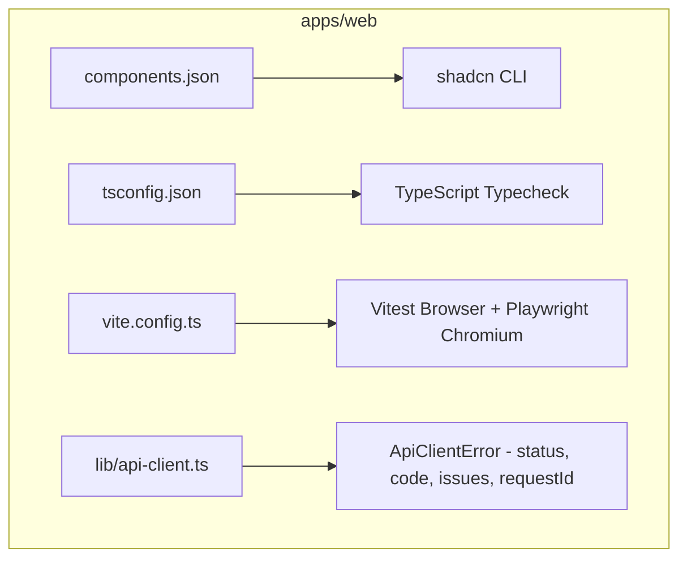

## Parent

PRD `docs/prds/automation-configuration-management.md`; prepara a base de ferramentas, configuração de componentes e infraestrutura de testes no navegador para o frontend de automações.

## What to build

Configurar e padronizar a infraestrutura de frontend no workspace `apps/web`:
1. Adicionar `apps/web/components.json` para alinhamento com shadcn CLI usando o alias canônico `@/`.
2. Ajustar `apps/web/tsconfig.json` para incluir `src/features/**` e arquivos de teste na compilação e verificação de tipos.
3. Configurar ambiente de testes de navegador com Vitest Browser, Playwright e `@vitest/browser-react` em `apps/web`.
4. Adicionar scripts `test`, `test:watch` e `test:browser` no `package.json` de `apps/web` e integrar ao pipeline/gates de validação.
5. Ampliar `ApiClientError` no client HTTP web para preservar `status`, `code`, `issues`, `requestId` e `message`.

## Acceptance criteria

- [x] `apps/web/components.json` criado e configurado para suporte a adições de componentes via CLI shadcn com alias `@/`.
- [x] `apps/web/tsconfig.json` inclui caminhos de `src/features/**` e testes no typechecking sem exclusões indevidas.
- [x] Vitest configurado com provider Playwright / Browser React para testes executados em ambiente DOM real.
- [x] Scripts `npm run test` e `npm run test:browser` executam os testes do workspace `apps/web` com sucesso.
- [x] O `ApiClientError` no client HTTP web preserva `status`, `code`, `issues`, `requestId` e `message`.
- [x] A seção `Result` documenta o comportamento entregue, Diagrama Mermaid caso aplicável, os principais arquivos ou contratos, Responsabilidade de cada arquivo, explicações sobre conceitos (caso aplicável e necessário), decisões e limites relevantes e as validações executadas.

## Blocked by

None - can start immediately

## Result

### Comportamento Entregue

1. **Configuração shadcn CLI**: Criado `apps/web/components.json` alinhado ao design system e usando os aliases `@/components`, `@/components/ui`, `@/lib/utils` e `@/hooks`.
2. **Typechecking em `apps/web`**: Atualizado `apps/web/tsconfig.json` para remover a exclusão indevida de `src/features/**` e de arquivos de teste, limpando resquícios do template não utilizados e garantindo compilação estrita limpa (0 erros).
3. **Ambiente de Testes no DOM Real (Vitest Browser + Playwright)**: Configurado Vitest com provider `@vitest/browser-playwright` executando Chromium headless sobre `vitest-browser-react`. Todos os testes de componentes e utilitários passam com tempo de execução inferior a 7 segundos.
4. **Metadados em `ApiClientError`**: `ApiClientError` e `apiFetch` foram expandidos para capturar e expor `status`, `code`, `issues`, `requestId` e `message`, permitindo que o frontend trate erros semânticos de validação e regras de negócio de automações (`AUTOMATION_NOT_PUBLISHABLE`, `AUTOMATION_TRIGGER_CONFLICT`, etc.).
5. **Scripts e Integração**: Adicionados scripts `test`, `test:watch` e `test:browser` em `apps/web/package.json` e o target `web:test` no `package.json` raiz.

### Principais Arquivos e Responsabilidades

- `apps/web/components.json`: Configuração canônica para o CLI do shadcn.
- `apps/web/tsconfig.json`: Inclusão de `features/**` e suíte de testes no typecheck.
- `apps/web/vite.config.ts`: Configuração do Vitest Browser com Playwright Chromium.
- `apps/web/src/lib/api-client.ts`: Cliente HTTP com preservação de metadados ricos em erros (`ApiClientError`).
- `apps/web/src/lib/api-client.test.ts`: Testes unitários para `ApiClientError` e `apiFetch`.

### Validações Executadas

- `npm run typecheck --workspaces --if-present`: 0 erros em todos os workspaces.
- `npm run web:test`: 15 arquivos de teste e 89 testes aprovados no Chromium headless.
- `npm run web:build`: Build de cliente e SSR concluído com sucesso.
- `npm run lint && npm run format:check`: Código formatado e em conformidade com ESLint/Prettier.
