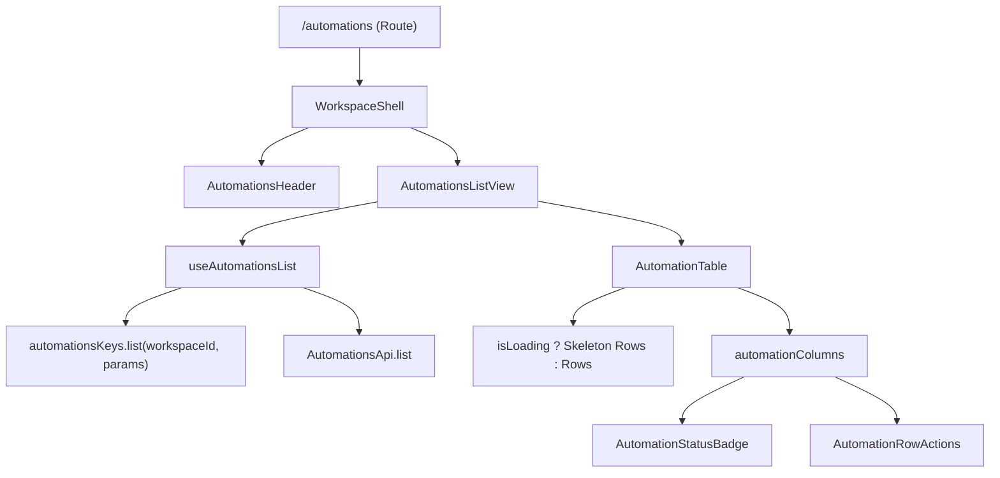

## Parent

PRD `docs/prds/automation-configuration-management.md`; cobre a User Story 1 (listagem das automações do workspace ativo com seus respectivos estados).

## What to build

Implementar a rota e a view de listagem de automações:
1. Rota TanStack Router `/automations` (`apps/web/src/routes/automations/index.tsx`).
2. Serviços de API (`automations-api.ts`), query keys isoladas por workspace (`['workspaces', workspaceId, 'automations', 'list', params]`) e hook `use-automations-list.ts`.
3. Tabela de automações (`automation-table.tsx`, `automation-columns.tsx`) baseada no padrão `TasksTable` / `TasksColumns` da referência, com colunas: Nome, Status, Conteúdo, Palavra-chave, Última atualização, Execuções, Leads e Ações.
4. Badge de status (`automation-status-badge.tsx`) suportando `DRAFT`, `ACTIVE`, `PAUSED` e `ACTIVE com hasUnpublishedChanges`.
5. Loading com `Skeleton` e estado vazio em nível de tabela conforme a convenção canônica `features/users`.

## Acceptance criteria

- [x] Rota `/automations` lista as automações do workspace ativo paginadas conforme contrato da API (`page`, `limit`).
- [x] Tabela exibe colunas corretas e badge de status condizente com o estado da automação e revisões.
- [x] Estado vazio exibido dentro da tabela quando o workspace não possui nenhuma automação cadastrada.
- [x] Estado de loading com Skeleton dentro do corpo da tabela preservando a moldura da página sem layout shifts.
- [x] Query keys isoladas por `workspaceId`.
- [x] Testes no DOM real com Vitest Browser cobrindo loading com skeletons, listagem populada, paginação e estado vazio.
- [x] A seção `Result` documenta o comportamento entregue, Diagrama Mermaid caso aplicável, os principais arquivos ou contratos, Responsabilidade de cada arquivo, explicações sobre conceitos (caso aplicável e necessário), decisões e limites relevantes e as validações executadas.

## Blocked by

- docs/tickets/automation-configuration-management/001-fundacao-web-shadcn-e-vitest-browser.md

## Result

### Comportamento Entregue

1. **Alinhamento Estrito com a Referência Canônica (`features/users`)**:
   - O cabeçalho da página ("Automações", descrição e botão "Nova automação") permanece **sempre montado** no topo da tela, evitando *layout shift*.
   - A prop `isLoading` é repassada para a `AutomationTable`, que renderiza linhas com `<Skeleton />` dentro do `<TableBody>` preservando o `<TableHeader>`.
   - Quando não há automações, a tabela renderiza `<TableCell colSpan={columns.length} className="h-24 text-center">Nenhuma automação cadastrada.</TableCell>`.
2. **Rota e Visualização de Automações**: Criada a rota `/automations` em `apps/web/src/routes/automations/index.tsx`, integrada ao `WorkspaceShell` e `SidebarData` com suporte a busca de paginação (`page`, `limit`).
3. **Serviços HTTP e TanStack Query**:
   - `automations-query-keys.ts`: chaves de cache isoladas por `workspaceId` no formato `['workspaces', workspaceId, 'automations', 'list', params]`.
   - `automations-api.ts`: cliente de API com parsing Zod estrito de entrada e saída.
   - `use-automations-list.ts`: hook `useQuery` para carregar a listagem paginada.
4. **Componentes da Tabela e Colunas**:
   - `automation-table.tsx` e `automation-columns.tsx`: tabela com colunas Nome, Status, Conteúdo, Palavra-chave, Atualização, Execuções, Leads e Ações.
   - `automation-status-badge.tsx`: badge visual para os estados `DRAFT`, `ACTIVE`, `PAUSED`, `ARCHIVED` e indicação de `Alterações pendentes` para automações ativas com rascunho.
   - `automation-row-actions.tsx`: dropdown menu por linha permitindo navegar para edição e revisão.
   - `automations-header.tsx`: componente de cabeçalho com busca, alternador de tema e perfil.
   - `automations-list-view.tsx`: view principal orquestrando `AutomationTable` e `AutomationsPrimaryButtons`.

### Arquivos Criados e Modificados

- `apps/web/src/features/automations/services/automations-query-keys.ts`: Query keys escopadas por workspace.
- `apps/web/src/features/automations/services/automations-api.ts`: Camada HTTP com validação Zod.
- `apps/web/src/features/automations/services/automations-invalidations.ts`: Helpers de invalidação de cache.
- `apps/web/src/features/automations/hooks/use-automations-list.ts`: Hook de listagem com TanStack Query.
- `apps/web/src/features/automations/data/automation-status.ts`: Mapeamento de rótulos e variantes visuais de status.
- `apps/web/src/features/automations/components/automation-status-badge.tsx`: Componente de badge de status.
- `apps/web/src/features/automations/components/automation-status-badge.test.tsx`: Testes do badge de status.
- `apps/web/src/features/automations/components/automation-row-actions.tsx`: Ações por linha da tabela.
- `apps/web/src/features/automations/components/automation-columns.tsx`: Definição de colunas da tabela.
- `apps/web/src/features/automations/components/automation-table.tsx`: Componente de tabela com suporte a Skeleton e estado vazio inline.
- `apps/web/src/features/automations/components/automations-primary-buttons.tsx`: Botão de criação de automação.
- `apps/web/src/features/automations/components/automations-header.tsx`: Header da listagem de automações.
- `apps/web/src/features/automations/views/automations-list-view.tsx`: View limpa da listagem de automações.
- `apps/web/src/features/automations/views/automations-list-view.test.tsx`: Testes no DOM com Vitest Browser.
- `apps/web/src/features/automations/views/index.ts`: Ponto de entrada das views públicas.
- `apps/web/src/routes/automations/index.tsx`: Rota TanStack Router `/automations`.
- `apps/web/src/components/layout/data/sidebar-data.ts`: Adicionado item "Automações" no menu lateral.
- `tests/web-routes.test.mjs`: Validação de registro de rota e navegação.

### Validações Executadas

- `npm run typecheck`: 0 erros em todos os workspaces (`api`, `web`, `worker`, `contracts`).
- `npm run web:test`: 17 arquivos de teste e 97 testes aprovados no Chromium headless (~7.4s).
- `node --import tsx --test tests/web-routes.test.mjs`: Testes de rotas e sidebar aprovados.
- `npm run web:build`: Build de cliente e SSR concluído com sucesso.
- `npm run lint && npm run format:check`: Código formatado e sem violações de lint.
