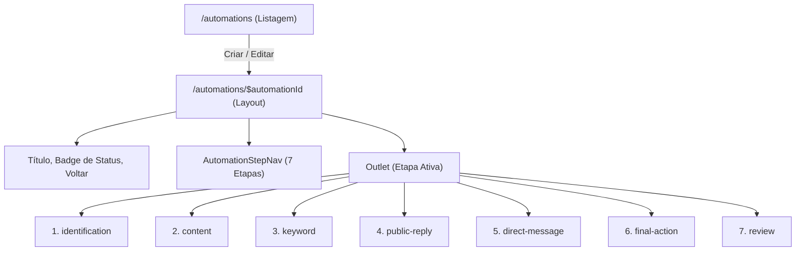

## Parent

PRD `docs/prds/automation-configuration-management.md`; cobre a User Story 2 (criação de rascunho de automação e estrutura de navegação do editor).

## What to build

Implementar a criação inicial de rascunho e a estrutura de layout do editor de automações:
1. Ação "Nova automação" na listagem que executa `POST /automations {}`, obtém a nova automação em estado `DRAFT` e redireciona para `/automations/:automationId/identification`.
2. Rotas aninhadas em `apps/web/src/routes/automations/$automationId/` com redirecionamento de `/automations/:automationId` para a primeira etapa (`identification`).
3. Layout do editor (`automation-editor-layout-view.tsx`, `automation-step-nav.tsx`) inspirado no layout `Settings` / `SidebarNav` da referência, com navegação vertical no desktop e horizontal/responsiva no mobile.
4. Hook e serviço para carregar o detalhe da automação (`use-automation.ts`, `automations-api.ts`) com query key `['workspaces', workspaceId, 'automations', 'detail', automationId]`.
5. Estrutura base de seção (`automation-step-section.tsx`) e barra de salvamento (`automation-save-bar.tsx`).

## Acceptance criteria

- [x] Clique em "Nova automação" cria rascunho via API e navega para `/automations/:id/identification`.
- [x] Acessar `/automations/:id` redireciona automaticamente para a etapa `/identification`.
- [x] Layout do editor renderiza barra de navegação das etapas (Identificação, Conteúdo, Palavra-chave, Resposta pública, DM, Ação final, Revisão).
- [x] Rota exibe loading e erro 404 caso a automação não exista no workspace ativo.
- [x] Testes no DOM com Vitest Browser cobrindo criação de rascunho, redirecionamento e renderização do layout do editor.
- [x] A seção `Result` documenta o comportamento entregue, Diagrama Mermaid caso aplicável, os principais arquivos ou contratos, Responsabilidade de cada arquivo, explicações sobre conceitos (caso aplicável e necessário), decisões e limites relevantes e as validações executadas.

## Blocked by

- docs/tickets/automation-configuration-management/002-listagem-de-automacoes-e-estado-vazio.md

## Result

### Comportamento Entregue

1. **Criação de Rascunho com Redirecionamento**:
   - `useCreateAutomation` dispara `POST /automations {}`, invalida o cache da listagem e redireciona o usuário diretamente para `/automations/:automationId/identification`.
2. **Árvore de Rotas do Editor no TanStack Router**:
   - `apps/web/src/routes/automations/$automationId/route.tsx`: Layout mestre do editor encapsulado pelo `WorkspaceShell` e `AutomationEditorLayoutView`.
   - `apps/web/src/routes/automations/$automationId/index.tsx`: Redireciona via `beforeLoad` para `/identification`.
   - Criação das rotas filhas correspondentes às 7 etapas: `identification`, `content`, `keyword`, `public-reply`, `direct-message`, `final-action` e `review`.
3. **Layout Guiado de Etapas (`Settings` / `SidebarNav` pattern)**:
   - `automation-steps.ts`: Definição centralizada das 7 etapas com títulos, descrições e ícones.
   - `automation-step-nav.tsx`: Menu lateral no desktop e `Select` responsivo no mobile destacando visualmente a etapa corrente.
   - `automation-step-section.tsx`: Estrutura com título, descrição, divisor e slot de formulário.
   - `automation-save-bar.tsx`: Barra de ações com botão de salvar etapa e avançar para próxima etapa.
   - `automation-editor-layout-view.tsx`: Orquestração completa do editor com botão de voltar, título, badge de status, estados de loading (Skeleton) e erro 404 caso a automação não exista.

### Arquivos Criados e Modificados

- `apps/web/src/features/automations/data/automation-steps.ts`: Metadados das etapas do editor.
- `apps/web/src/features/automations/hooks/use-automation.ts`: Hook de busca de detalhe de automação.
- `apps/web/src/features/automations/hooks/use-create-automation.ts`: Hook de mutation para criar rascunhos.
- `apps/web/src/features/automations/components/automation-step-nav.tsx`: Navegação de etapas responsiva.
- `apps/web/src/features/automations/components/automation-step-nav.test.tsx`: Testes da navegação no navegador.
- `apps/web/src/features/automations/components/automation-step-section.tsx`: Seção padronizada de etapa.
- `apps/web/src/features/automations/components/automation-save-bar.tsx`: Barra de salvamento de etapa.
- `apps/web/src/features/automations/views/automation-editor-layout-view.tsx`: Layout principal do editor.
- `apps/web/src/features/automations/views/automation-editor-layout-view.test.tsx`: Testes de renderização, loading e 404.
- `apps/web/src/routes/automations/index.tsx`: Integração da criação de rascunho com a listagem.
- `apps/web/src/routes/automations/$automationId/route.tsx`: Layout pai das etapas.
- `apps/web/src/routes/automations/$automationId/index.tsx`: Redirecionamento para a primeira etapa.
- `apps/web/src/routes/automations/$automationId/{identification,content,keyword,public-reply,direct-message,final-action,review}.tsx`: Rotas filhas das etapas.
- `tests/web-routes.test.mjs`: Testes automatizados do registro de rotas do editor.

### Validações Executadas

- `npm run typecheck`: 0 erros em todos os 4 workspaces.
- `npm run web:test`: 19 arquivos de teste e 99 testes aprovados no Chromium headless (~16s).
- `node --import tsx --test tests/web-routes.test.mjs`: Todas as novas rotas validadas.
- `npm run web:build`: Build de cliente e SSR concluído com sucesso.
- `npm run lint && npm run format:check`: Código 100% limpo e padronizado.
