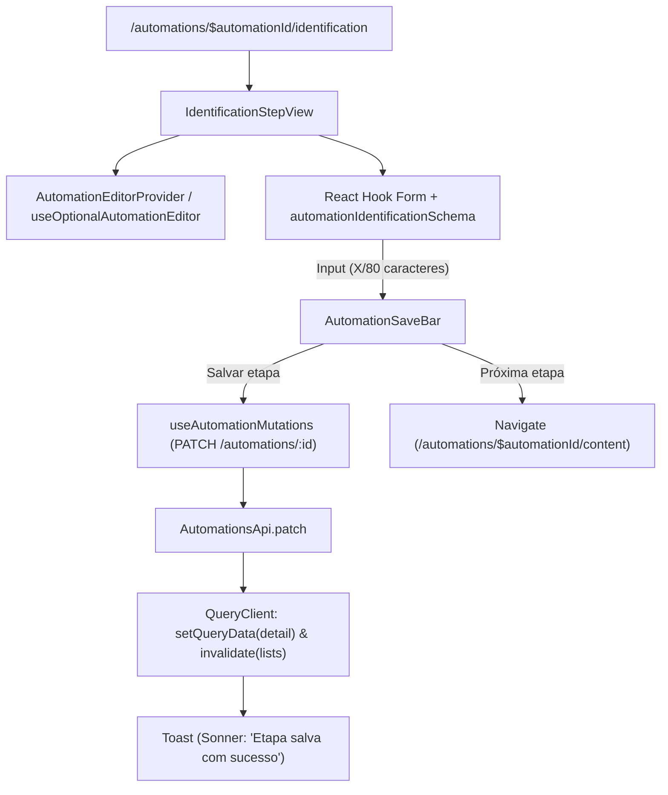

## Parent

PRD `docs/prds/automation-configuration-management.md`; cobre a configuração inicial do nome da automação e a mecânica de formulário por etapa com salvamento explícito.

## What to build

Implementar a view e formulário da etapa 1 (Identificação):
1. Rota `/automations/:automationId/identification` e view `identification-step-view.tsx`.
2. Schema Zod `automationIdentificationSchema` em `automation-step-schemas.ts` (nome opcional no rascunho, até 80 caracteres).
3. Formulário com React Hook Form integrado à barra de salvamento (`automation-save-bar.tsx`).
4. Hook de mutação `use-automation-mutations.ts` (`PATCH /automations/:id` com `{ name }`).
5. Atualização otimista/direta do cache de detalhe e feedback de sucesso ou erro no salvamento.

## Acceptance criteria

- [x] Campo de nome da automação permite preencher até 80 caracteres e valida comprimento máximo.
- [x] Botão de salvar dispara `PATCH /automations/:id` e exibe feedback de progresso e sucesso.
- [x] Botão de salvar/avançar permite seguir para a próxima etapa (`/content`).
- [x] Rascunho permite salvar campo em branco sem bloquear persistência da revisão atual.
- [x] Testes no DOM com Vitest Browser cobrindo renderização, digitação, validação de caracteres, salvamento e atualização de cache.
- [x] A seção `Result` documenta o comportamento entregue, Diagrama Mermaid caso aplicável, os principais arquivos ou contratos, Responsabilidade de cada arquivo, explicações sobre conceitos (caso aplicável e necessário), decisões e limites relevantes e as validações executadas.

## Blocked by

- docs/tickets/automation-configuration-management/003-criacao-de-rascunho-e-layout-do-editor.md

## Result

### Comportamento Entregue

1. **Schema de Validação da Identificação (`automationIdentificationSchema`)**:
   - Valida nome de até 80 caracteres.
   - Permite campo opcional ou string vazia durante a edição do rascunho, viabilizando o salvamento flexível sem bloqueios prévios.
2. **Hook de Mutações (`useAutomationMutations`)**:
   - Encapsula chamadas a `PATCH /automations/:id`.
   - Aplica atualização direta ao cache do TanStack Query (`automationsKeys.detail`) com a resposta da mutação para feedback instantâneo no cabeçalho e demais componentes.
   - Dispara invalidação das queries de listagem (`automationsKeys.lists`) para manter a tabela do painel sincronizada.
   - Exibe toasts de sucesso e tratamento de erros com `sonner`.
3. **Contexto do Editor de Automação (`AutomationEditorProvider`)**:
   - Disponibiliza `workspaceId`, `automationId` e o objeto `automation` através do hook `useAutomationEditor` / `useOptionalAutomationEditor` para todas as views filhas das etapas.
4. **View da Etapa 1 (`IdentificationStepView`)**:
   - Integra formulário do React Hook Form com `@hookform/resolvers/zod`.
   - Exibe contador de caracteres em tempo real (`X/80 caracteres`).
   - Normaliza espaços e envia `null` quando o campo está vazio, respeitando o contrato de limpeza de dados em rascunhos.
   - Integrado com `AutomationSaveBar`, fornecendo ação de "Salvar etapa" e botão de avanço "Próxima etapa" (`/automations/:automationId/content`).

### Arquivos Criados e Modificados

- `apps/web/src/features/automations/data/automation-step-schemas.ts`: Schema Zod e tipos para o formulário de identificação.
- `apps/web/src/features/automations/data/automation-step-schemas.test.ts`: Testes unitários para limites e regras do schema.
- `apps/web/src/features/automations/components/automation-editor-provider.tsx`: Provedor e hook de contexto do editor.
- `apps/web/src/features/automations/hooks/use-automation-mutations.ts`: Hook de mutação `useAutomationMutations` para persistência e sincronização de cache.
- `apps/web/src/features/automations/hooks/use-automation-mutations.test.tsx`: Testes do ciclo de mutação, cache e feedback.
- `apps/web/src/features/automations/views/identification-step-view.tsx`: View com formulário e barra de ações.
- `apps/web/src/features/automations/views/identification-step-view.test.tsx`: Testes de DOM com Vitest Browser (renderização, digitação, contador, validação de 80 caracteres, salvamento e navegação).
- `apps/web/src/features/automations/views/automation-editor-layout-view.tsx`: Integração do `AutomationEditorProvider` em torno do conteúdo das etapas.
- `apps/web/src/features/automations/views/index.ts`: Exportação do `IdentificationStepView`.
- `apps/web/src/routes/automations/$automationId/identification.tsx`: Conexão da rota da etapa com a view `IdentificationStepView`.

### Validações Executadas

- `npm run typecheck`: 0 erros de compilação TypeScript em todos os 4 workspaces (`web`, `api`, `worker`, `contracts`).
- `npm run web:test`: 22 arquivos de teste e 109 testes aprovados no Chromium headless.
- `node --import tsx --test tests/web-routes.test.mjs`: Rotas validadas.
- `npm run web:build`: Build de produção do cliente e SSR concluído com sucesso.
- `npm run lint && npm run format:check`: Código 100% conforme ESLint e Prettier.
- `graphify update .`: Grafo de conhecimento atualizado com sucesso.

