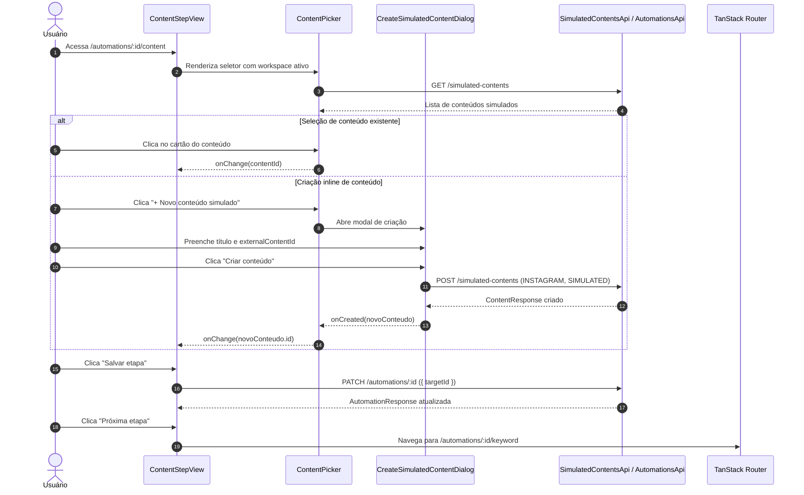

## Parent

PRD `docs/prds/automation-configuration-management.md`; cobre a User Story 3 (associação de exatamente um conteúdo simulado e criação inline de conteúdo para testes).

## What to build

Implementar a etapa 2 (Conteúdo):
1. Rota `/automations/:automationId/content` e view `content-step-view.tsx`.
2. Serviço `simulated-contents-api.ts` e hook `use-simulated-contents.ts` com query key `['workspaces', workspaceId, 'simulated-contents', params]`.
3. Componente seletor de conteúdo (`content-picker.tsx`) permitindo buscar e selecionar exatamente um item da lista.
4. Diálogo de criação inline de conteúdo simulado (`create-simulated-content-dialog.tsx`) baseado no padrão `UsersActionDialog`, com campos de título e identificador estável, fixando `provider: INSTAGRAM` e `mode: SIMULATED`.
5. Salvamento da associação de conteúdo-alvo via `PATCH /automations/:id` com `{ targetId }`.

## Acceptance criteria

- [x] Lista de conteúdos simulados carregada a partir do workspace ativo.
- [x] Usuário consegue selecionar um conteúdo existente para a automação.
- [x] Usuário consegue abrir o modal, criar um novo conteúdo simulado (`POST /simulated-contents`), que é automaticamente selecionado após criação.
- [x] Salvamento da etapa persiste o `target` selecionado no backend.
- [x] Testes no DOM com Vitest Browser cobrindo listagem de conteúdos, seleção, abertura de modal, criação inline e persistência do target.
- [x] A seção `Result` documenta o comportamento entregue, Diagrama Mermaid caso aplicável, os principais arquivos ou contratos, Responsabilidade de cada arquivo, explicações sobre conceitos (caso aplicável e necessário), decisões e limites relevantes e as validações executadas.

## Blocked by

- docs/tickets/automation-configuration-management/004-etapa-identificacao-e-salvamento-explicito.md

## Result

### Comportamento entregue

Implementada a etapa 2 (Conteúdo) do fluxo de configuração de automações em `apps/web`:
- Rota `/automations/:automationId/content` conectada à `ContentStepView`.
- Seletor de conteúdo (`ContentPicker`) com busca textual em tempo real por título ou identificador externo (`externalContentId`), exibição de cartões selecionáveis com badges de provider (`INSTAGRAM`), modalidade (`SIMULATED`) e tipo de mídia (`POST`/`VIDEO`).
- Diálogo modal de criação inline (`CreateSimulatedContentDialog`), permitindo criar uma nova publicação simulada (`POST /simulated-contents`) e auto-selecioná-la imediatamente para a automação em edição.
- Persistência explícita via `AutomationSaveBar` acionando `PATCH /automations/:id` com `{ targetId }` (ou `null` para desassociação/limpeza em rascunhos).
- Navegação para a próxima etapa (`/automations/:automationId/keyword`).

### Diagrama de Fluxo

### Arquivos e Contratos

- [`apps/web/src/features/automations/data/automation-step-schemas.ts`](file:///home/luis/Documentos/Git/Engancha/apps/web/src/features/automations/data/automation-step-schemas.ts): Schema Zod `automationContentSchema` para validação de `targetId`.
- [`apps/web/src/features/automations/services/simulated-contents-query-keys.ts`](file:///home/luis/Documentos/Git/Engancha/apps/web/src/features/automations/services/simulated-contents-query-keys.ts): Definição padronizada de chaves de query do TanStack Query para listagens e escopo de workspace.
- [`apps/web/src/features/automations/services/simulated-contents-api.ts`](file:///home/luis/Documentos/Git/Engancha/apps/web/src/features/automations/services/simulated-contents-api.ts): Cliente de API com validação por contratos Zod (`contentListResponseSchema`, `contentResponseSchema`).
- [`apps/web/src/features/automations/hooks/use-simulated-contents.ts`](file:///home/luis/Documentos/Git/Engancha/apps/web/src/features/automations/hooks/use-simulated-contents.ts): Hook de consulta com React Query.
- [`apps/web/src/features/automations/hooks/use-create-simulated-content.ts`](file:///home/luis/Documentos/Git/Engancha/apps/web/src/features/automations/hooks/use-create-simulated-content.ts): Hook de mutação para criação inline com invalidação de cache.
- [`apps/web/src/features/automations/components/create-simulated-content-dialog.tsx`](file:///home/luis/Documentos/Git/Engancha/apps/web/src/features/automations/components/create-simulated-content-dialog.tsx): Diálogo acessível para criação de publicação simulada.
- [`apps/web/src/features/automations/components/content-picker.tsx`](file:///home/luis/Documentos/Git/Engancha/apps/web/src/features/automations/components/content-picker.tsx): Componente seletor de conteúdo com busca, estados vazios e seleção singular.
- [`apps/web/src/features/automations/views/content-step-view.tsx`](file:///home/luis/Documentos/Git/Engancha/apps/web/src/features/automations/views/content-step-view.tsx): View principal da etapa 2.
- [`apps/web/src/routes/automations/$automationId/content.tsx`](file:///home/luis/Documentos/Git/Engancha/apps/web/src/routes/automations/$automationId/content.tsx): Rota TanStack Router integrando a view.
- [`apps/web/src/features/automations/views/content-step-view.test.tsx`](file:///home/luis/Documentos/Git/Engancha/apps/web/src/features/automations/views/content-step-view.test.tsx): Suíte de testes no DOM com Vitest Browser.

### Decisões e Limites

1. **Separação de responsabilidades**: Seguindo a convenção de `apps/web/src/features/users`, componentes e views não realizam chamadas HTTP diretas nem gerenciam query keys; essas funções são encapsuladas em `services/` e `hooks/`.
2. **Auto-seleção pós-criação**: Ao submeter o diálogo de criação inline, o novo item retornado pela API é imediatamente atribuído ao formulário da automação e focado na interface, economizando cliques do usuário.
3. **Persistência explícita**: Em rascunho (`DRAFT`), o backend aceita `targetId: null` para permitir desvincular ou salvar etapas intermediárias sem travar o usuário.

### Validações Executadas

- **Testes Unitários e DOM**: `npm run web:test -- src/features/automations/views/content-step-view.test.tsx` (6 testes passando).
- **Typecheck do Monorepo**: `npm run typecheck` (0 erros).
- **Lint e Formatação**: `npm run lint` e `npm run format:check` (100% compliant).
- **Verificação Global**: `npm run verify` (126 testes de frontend + testes de API, Worker e E2E passando com sucesso).

