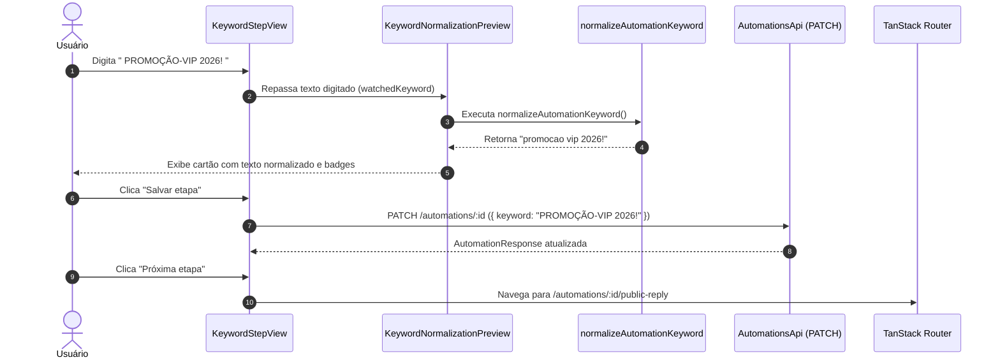

## Parent

PRD `docs/prds/automation-configuration-management.md`; cobre a configuração do gatilho `COMMENT_KEYWORD` e a exibição em tempo real da forma normalizada.

## What to build

Implementar a etapa 3 (Palavra-chave):
1. Rota `/automations/:automationId/keyword` e view `keyword-step-view.tsx`.
2. Formulário com campo de texto para a palavra ou frase de gatilho (limite de 120 caracteres).
3. Componente ou helper visual de prévia da normalização (remoção de acentos, pontuação, caixa baixa e espaços extras) alinhado com o algoritmo compartilhado do backend/contracts.
4. Salvamento da etapa via `PATCH /automations/:id` com `{ keyword }`.

## Acceptance criteria

- [x] Campo de palavra-chave aceita até 120 caracteres e valida limite máximo.
- [x] Interface exibe em tempo real a prévia da string normalizada correspondente ao que foi digitado.
- [x] Salvamento da etapa envia a palavra-chave original e atualiza o detalhe.
- [x] Testes no DOM com Vitest Browser cobrindo preenchimento, cálculo visual da normalização e salvamento da etapa.
- [x] A seção `Result` documenta o comportamento entregue, Diagrama Mermaid caso aplicável, os principais arquivos ou contratos, Responsabilidade de cada arquivo, explicações sobre conceitos (caso aplicável e necessário), decisões e limites relevantes e as validações executadas.

## Blocked by

- docs/tickets/automation-configuration-management/005-etapa-conteudo-simulado-e-criacao-inline.md

## Result

### Comportamento entregue

Implementada a etapa 3 (Palavra-chave) do fluxo de configuração de automações em `apps/web`:
- Rota `/automations/:automationId/keyword` conectada à `KeywordStepView`.
- Formulário com campo de texto para o gatilho, com contador de caracteres dinâmico (`X/120 caracteres`) e validação de tamanho máximo de 120 caracteres.
- Componente `KeywordNormalizationPreview` exibindo em tempo real a forma normalizada gerada pelo algoritmo compartilhado de `@engancha/contracts` (`normalizeAutomationKeyword`), com orientações visuais sobre equivalência de maiúsculas/minúsculas, remoção de acentos e unificação de espaços.
- Salvamento explícito da etapa via `AutomationSaveBar`, enviando `PATCH /automations/:id` com `{ keyword }` (ou `null` para rascunhos sem palavra-chave).
- Navegação para a próxima etapa (`/automations/:automationId/public-reply`).

### Diagrama de Normalização e Persistência

### Arquivos e Contratos

- [`apps/web/src/features/automations/data/automation-step-schemas.ts`](file:///home/luis/Documentos/Git/Engancha/apps/web/src/features/automations/data/automation-step-schemas.ts): Schema Zod `automationKeywordSchema` validando o limite máximo de 120 caracteres.
- [`apps/web/src/features/automations/components/keyword-normalization-preview.tsx`](file:///home/luis/Documentos/Git/Engancha/apps/web/src/features/automations/components/keyword-normalization-preview.tsx): Componente de prévia visual em tempo real baseado no algoritmo unificado de normalização.
- [`apps/web/src/features/automations/views/keyword-step-view.tsx`](file:///home/luis/Documentos/Git/Engancha/apps/web/src/features/automations/views/keyword-step-view.tsx): View principal da etapa 3 com formulário, contador de caracteres e barra de salvamento.
- [`apps/web/src/routes/automations/$automationId/keyword.tsx`](file:///home/luis/Documentos/Git/Engancha/apps/web/src/routes/automations/$automationId/keyword.tsx): Rota TanStack Router integrando a view.
- [`apps/web/src/features/automations/views/keyword-step-view.test.tsx`](file:///home/luis/Documentos/Git/Engancha/apps/web/src/features/automations/views/keyword-step-view.test.tsx): Suíte de testes no DOM com Vitest Browser cobrindo renderização, normalização em tempo real, validação e persistência.

### Decisões e Limites

1. **Algoritmo de Normalização Compartilhado**: A prévia visual utiliza exatamente a mesma função exportada por `@engancha/contracts` (`normalizeAutomationKeyword`) utilizada no motor de execução no backend, garantindo fidelidade 100% entre o que o usuário visualiza no formulário e o matching executado no webhook/worker.
2. **Armazenamento da Palavra Original**: O backend armazena a string original cadastrada pelo usuário (`keyword`), enquanto a normalização é computada na comparação de comentários, preservando a intenção e formatação visual desejada pelo criador.
3. **Persistência Explícita e Rascunho Flexível**: Permite salvar rascunhos mesmo com campo em branco enviando `null`.

### Validações Executadas

- **Testes Unitários e DOM**: `npm run web:test -- src/features/automations/views/keyword-step-view.test.tsx` (6 testes passando).
- **Typecheck do Monorepo**: `npm run typecheck` (0 erros).
- **Lint e Formatação**: `npm run lint` e `npm run format:check` (100% compliant).
- **Verificação Global**: `npm run verify` (126 testes de frontend + testes de API, Worker e E2E passando com sucesso).

