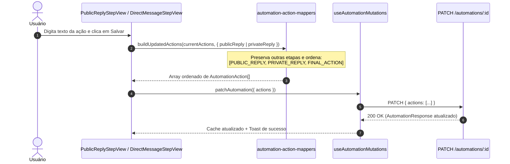

## Parent

PRD `docs/prds/automation-configuration-management.md`; cobre a configuração das ações obrigatórias `PUBLIC_REPLY` e `PRIVATE_REPLY` com garantia da ordem determinística.

## What to build

Implementar as etapas 4 (Resposta pública) e 5 (Mensagem direta):
1. Rota `/automations/:automationId/public-reply` e view `public-reply-step-view.tsx` para edição do texto da ação `PUBLIC_REPLY` (até 1.000 caracteres).
2. Rota `/automations/:automationId/direct-message` e view `direct-message-step-view.tsx` para edição do texto da ação `PRIVATE_REPLY` (até 1.000 caracteres).
3. Mapeador de ações `automation-action-mappers.ts` para garantir que ao salvar qualquer ação individualmente, a sequência total enviada ao backend mantenha sempre a ordem determinística: `[PUBLIC_REPLY, PRIVATE_REPLY, <FINAL_ACTION>]`.
4. Salvamento de cada etapa via `PATCH /automations/:id` com `{ actions: [...] }`.

## Acceptance criteria

- [x] Formulário de resposta pública permite editar mensagem de até 1.000 caracteres com contador e validação.
- [x] Formulário de mensagem direta permite editar mensagem de até 1.000 caracteres com contador e validação.
- [x] Salvamento de cada etapa preserva as ações já configuradas nas outras etapas, garantindo a ordem canônica no payload.
- [x] Testes no DOM com Vitest Browser cobrindo edição, limites de texto, salvamento isolado de cada etapa e integridade da sequência de ações.
- [x] A seção `Result` documenta o comportamento entregue, Diagrama Mermaid caso aplicável, os principais arquivos ou contratos, Responsabilidade de cada arquivo, explicações sobre conceitos (caso aplicável e necessário), decisões e limites relevantes e as validações executadas.

## Blocked by

- docs/tickets/automation-configuration-management/006-etapa-palavra-chave-e-normalizacao.md

## Result

### Comportamento entregue

- **Etapa 4 (Resposta Pública)**: Criada a view [`PublicReplyStepView`](file:///home/luis/Documentos/Git/Engancha/apps/web/src/features/automations/views/public-reply-step-view.tsx) na rota `/automations/:automationId/public-reply`. Permite redigir o comentário público postado no Instagram em resposta ao gatilho acionado, com limite de 1.000 caracteres, contador em tempo real e botão de avançar para a etapa seguinte (`/direct-message`).
- **Etapa 5 (Mensagem Direta / DM)**: Criada a view [`DirectMessageStepView`](file:///home/luis/Documentos/Git/Engancha/apps/web/src/features/automations/views/direct-message-step-view.tsx) na rota `/automations/:automationId/direct-message`. Permite configurar a mensagem de direct com limite de 1.000 caracteres, contador em tempo real e botão de avançar para `/final-action`.
- **Ordem Canônica Determinística de Ações**: Implementado o utilitário [`automation-action-mappers.ts`](file:///home/luis/Documentos/Git/Engancha/apps/web/src/features/automations/data/automation-action-mappers.ts) que compõe a lista de ações mantendo a ordem estrita `[PUBLIC_REPLY, PRIVATE_REPLY, <FINAL_ACTION>]` independentemente da ordem em que o usuário edita ou salva cada etapa.

### Diagrama de Sequência e Composição das Ações

### Arquivos e Responsabilidades

- [`apps/web/src/features/automations/data/automation-action-mappers.ts`](file:///home/luis/Documentos/Git/Engancha/apps/web/src/features/automations/data/automation-action-mappers.ts): Extração e recomposição determinística de ações (`getPublicReplyText`, `getPrivateReplyText`, `getFinalAction`, `orderAutomationActions`, `buildUpdatedActions`).
- [`apps/web/src/features/automations/data/automation-action-mappers.test.ts`](file:///home/luis/Documentos/Git/Engancha/apps/web/src/features/automations/data/automation-action-mappers.test.ts): Testes unitários para extração, ordenação e preservação cruzada de ações ao atualizar cada etapa.
- [`apps/web/src/features/automations/data/automation-step-schemas.ts`](file:///home/luis/Documentos/Git/Engancha/apps/web/src/features/automations/data/automation-step-schemas.ts): Schemas Zod de validação para `automationPublicReplySchema` e `automationDirectMessageSchema`.
- [`apps/web/src/features/automations/views/public-reply-step-view.tsx`](file:///home/luis/Documentos/Git/Engancha/apps/web/src/features/automations/views/public-reply-step-view.tsx): View da etapa de Resposta Pública com Textarea, contador de caracteres e barra de navegação/salvamento.
- [`apps/web/src/features/automations/views/public-reply-step-view.test.tsx`](file:///home/luis/Documentos/Git/Engancha/apps/web/src/features/automations/views/public-reply-step-view.test.tsx): Testes com Vitest Browser Playwright cobrindo carregamento, digitação, limite de 1.000 caracteres, remoção de ação vazia, payload canônico e navegação.
- [`apps/web/src/features/automations/views/direct-message-step-view.tsx`](file:///home/luis/Documentos/Git/Engancha/apps/web/src/features/automations/views/direct-message-step-view.tsx): View da etapa de Mensagem Direta (DM) com Textarea, contador de caracteres e barra de navegação/salvamento.
- [`apps/web/src/features/automations/views/direct-message-step-view.test.tsx`](file:///home/luis/Documentos/Git/Engancha/apps/web/src/features/automations/views/direct-message-step-view.test.tsx): Testes com Vitest Browser Playwright cobrindo edição, validação de limites, salvamento isolado e preservação da sequência.
- [`apps/web/src/routes/automations/$automationId/public-reply.tsx`](file:///home/luis/Documentos/Git/Engancha/apps/web/src/routes/automations/$automationId/public-reply.tsx): Rota TanStack Router conectando a view `PublicReplyStepView`.
- [`apps/web/src/routes/automations/$automationId/direct-message.tsx`](file:///home/luis/Documentos/Git/Engancha/apps/web/src/routes/automations/$automationId/direct-message.tsx): Rota TanStack Router conectando a view `DirectMessageStepView`.

### Decisões e Limites

1. **Tratamento de Rascunho vs Publicação**: No modo de rascunho, o usuário pode salvar qualquer etapa com texto vazio (o que remove a ação correspondente do array de ações sem invalidar o rascunho). A obrigatoriedade e validação completa continuam centralizadas no backend ao publicar via `validatePublishableAutomation`.
2. **Imutabilidade e Preservação Cruzada**: Cada formulário lê apenas o estado correspondente da ação a partir de `current.actions` e, ao salvar, mescla a alteração preservando intactas as ações das etapas anteriores/posteriores.

### Validações Executadas

- Testes unitários de mappers: 11 testes passaram em `automation-action-mappers.test.ts`.
- Testes unitários de schemas: 21 testes passaram em `automation-step-schemas.test.ts`.
- Testes no DOM (Vitest Browser / Playwright Chromium):
  - `PublicReplyStepView`: 6 testes passaram.
  - `DirectMessageStepView`: 6 testes passaram.
- Typecheck TypeScript (`tsc --noEmit`): 0 erros.
- Suíte completa web: 28 arquivos de teste e 170 testes passaram com sucesso.

