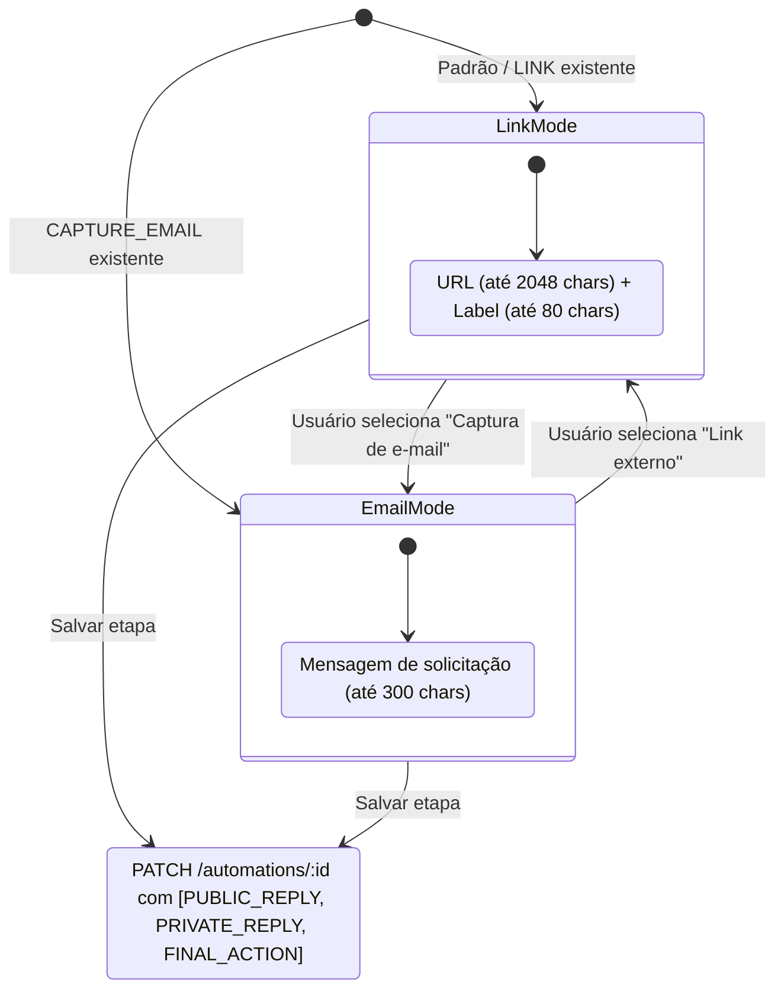

## Parent

PRD `docs/prds/automation-configuration-management.md`; cobre a configuração da ação final exclusiva (`LINK` ou `CAPTURE_EMAIL`).

## What to build

Implementar a etapa 6 (Ação final):
1. Rota `/automations/:automationId/final-action` e view `final-action-step-view.tsx`.
2. Seletor de modo exclusivo entre `LINK` (URL até 2.048 caracteres + rótulo até 80 caracteres) e `CAPTURE_EMAIL` (pergunta/chamada até 300 caracteres).
3. Schemas de validação condicionais com Zod em `automation-step-schemas.ts`.
4. Integração com `automation-action-mappers.ts` para posicionar a ação final na terceira posição da lista enviada ao backend.
5. Salvamento via `PATCH /automations/:id`.

## Acceptance criteria

- [x] Interface permite alternar de forma clara e acessível entre `LINK` e `CAPTURE_EMAIL`.
- [x] Quando `LINK` está selecionado, valida campos de URL (formato e limite) e rótulo do botão.
- [x] Quando `CAPTURE_EMAIL` está selecionado, valida campo de mensagem/pergunta de captura.
- [x] Salvamento persiste a ação final correspondente mantendo `PUBLIC_REPLY` e `PRIVATE_REPLY` intactas na sequência.
- [x] Testes no DOM com Vitest Browser cobrindo alternância de tipo de ação, validações específicas de cada formulário e salvamento.
- [x] A seção `Result` documenta o comportamento entregue, Diagrama Mermaid caso aplicável, os principais arquivos ou contratos, Responsabilidade de cada arquivo, explicações sobre conceitos (caso aplicável e necessário), decisões e limites relevantes e as validações executadas.

## Blocked by

- docs/tickets/automation-configuration-management/007-etapas-resposta-publica-e-mensagem-direta.md

## Result

### Comportamento entregue

- **Etapa 6 (Ação Final)**: Criada a view [`FinalActionStepView`](file:///home/luis/Documentos/Git/Engancha/apps/web/src/features/automations/views/final-action-step-view.tsx) na rota `/automations/:automationId/final-action`.
- **Seletor de Modo Exclusivo**: Implementado seletor visual acessível via `RadioGroup` estilizado com cards clicáveis que permite alternar exclusivamente entre:
  1. **Link externo (`LINK`)**: URL de destino (até 2.048 caracteres, validação de formato de URL) e rótulo do botão (até 80 caracteres, padrão "Abrir link").
  2. **Captura de e-mail (`CAPTURE_EMAIL`)**: Prompt/mensagem de solicitação (até 300 caracteres com contador dinâmico).
- **Integração Determinística**: Ao salvar a ação final, `automation-action-mappers.ts` posiciona a ação terminal exatamente na terceira posição do array, preservando `PUBLIC_REPLY` e `PRIVATE_REPLY` configuradas nas etapas anteriores.
- **Navegação**: O botão de próxima etapa avança para `/automations/:automationId/review` (etapa 7 de revisão e publicação).

### Diagrama de Estados da Ação Final

### Arquivos e Responsabilidades

- [`apps/web/src/features/automations/views/final-action-step-view.tsx`](file:///home/luis/Documentos/Git/Engancha/apps/web/src/features/automations/views/final-action-step-view.tsx): View do formulário da etapa de ação final, gerenciamento de estado entre modos, validações e submissão.
- [`apps/web/src/features/automations/views/final-action-step-view.test.tsx`](file:///home/luis/Documentos/Git/Engancha/apps/web/src/features/automations/views/final-action-step-view.test.tsx): Testes no DOM com Vitest Browser cobrindo renderização inicial por tipo existente, alternância dinâmica de modo, validação de URL inválida, limite de caracteres e submissão com preservação de posições.
- [`apps/web/src/features/automations/data/automation-step-schemas.ts`](file:///home/luis/Documentos/Git/Engancha/apps/web/src/features/automations/data/automation-step-schemas.ts): Schema condicional com `z.discriminatedUnion('actionType', [...])` validando campos específicos conforme o modo selecionado.
- [`apps/web/src/routes/automations/$automationId/final-action.tsx`](file:///home/luis/Documentos/Git/Engancha/apps/web/src/routes/automations/$automationId/final-action.tsx): Rota TanStack Router conectando a view `FinalActionStepView`.
- [`apps/web/src/features/automations/views/index.ts`](file:///home/luis/Documentos/Git/Engancha/apps/web/src/features/automations/views/index.ts): Exportação pública da view da feature.

### Decisões e Limites

1. **União Discriminada no Zod**: O formulário utiliza uma união discriminada pelo campo `actionType`, permitindo alternância estrita e tipada entre os schemas de validação de `LINK` e `CAPTURE_EMAIL`.
2. **Substituição de Ação Terminal**: A PRD estabelece que uma automação só pode possuir no máximo 1 ação final. Ao alternar de `LINK` para `CAPTURE_EMAIL` (ou vice-versa) e salvar, a ação terminal anterior é automaticamente substituída mantendo a ordem canônica do backend `[PUBLIC_REPLY, PRIVATE_REPLY, <FINAL_ACTION>]`.

### Validações Executadas

- Testes no DOM (Vitest Browser / Playwright Chromium): 8 testes passaram em `final-action-step-view.test.tsx`.
- Testes unitários de schemas: 21 testes passaram em `automation-step-schemas.test.ts`.
- Typecheck TypeScript (`tsc --noEmit`): 0 erros.
- Suíte completa web: 28 arquivos de teste e 170 testes passaram com sucesso.

