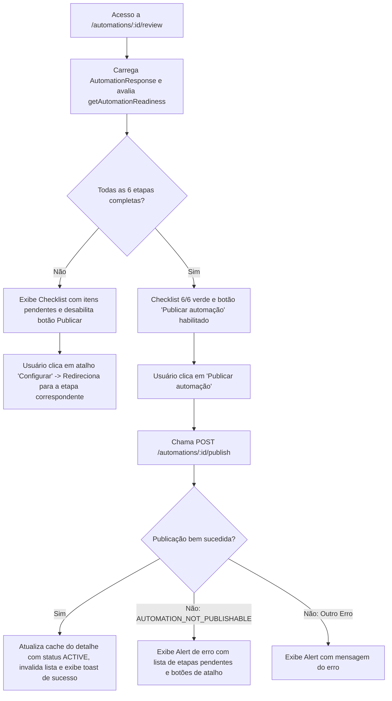

## Parent

PRD `docs/prds/automation-configuration-management.md`; cobre a User Story 6 e a consolidação do resumo, checklist de validação e publicação de automação.

## What to build

Implementar a etapa 7 (Revisão) e o fluxo de publicação:
1. Rota `/automations/:automationId/review` e view `review-step-view.tsx` com componente `automation-review.tsx`.
2. Exibição consolidada de todas as etapas configuradas (Nome, Conteúdo, Gatilho, Resposta pública, DM, Ação final).
3. Checklist de prontidão para publicação apontando campos/etapas incompletas com links de atalho para a etapa correspondente.
4. Botão "Publicar automação" disparando `POST /automations/:id/publish`.
5. Tratamento de erro `AUTOMATION_NOT_PUBLISHABLE` destacando os problemas retornados pela API e feedback claro de sucesso mudando o status para `ACTIVE`.

## Acceptance criteria

- [x] Tela de revisão exibe resumo fiel de todos os dados configurados no rascunho.
- [x] Checklist indica visualmente itens pendentes e bloqueia o botão de publicar se houver pendências locais.
- [x] Ao clicar em "Publicar", chama `POST /automations/:id/publish` e atualiza o detalhe e a listagem.
- [x] Tratamento de erros de validação do backend (`AUTOMATION_NOT_PUBLISHABLE`) exibindo issues por etapa.
- [x] Testes no DOM com Vitest Browser cobrindo renderização do checklist, resumo completo, tentativa de publicação inválida e publicação com sucesso.
- [x] A seção `Result` documenta o comportamento entregue, Diagrama Mermaid caso aplicável, os principais arquivos ou contratos, Responsabilidade de cada arquivo, explicações sobre conceitos (caso aplicável e necessário), decisões e limites relevantes e as validações executadas.

## Blocked by

- docs/tickets/automation-configuration-management/008-etapa-acao-final-link-ou-captura-email.md

## Result

### Comportamento Entregue

1. **Checklist de Prontidão**: Implementação de visualizador de prontidão avaliando os 6 requisitos necessários para publicação (Identificação, Conteúdo, Gatilho/Palavra-chave, Resposta pública, Mensagem direta e Ação final). Cada item exibe status (`Completo` vs `Pendente`), resumo do valor preenchido e botão de atalho para a respectiva etapa.
2. **Resumo Consolidado**: Seções em cards exibindo de forma clara os dados configurados para cada etapa do rascunho, com botões dedicados de edição direcionando para as rotas correspondentes.
3. **Fluxo de Publicação e Mutação**: Suporte a publicação via `publishAutomation` integrado ao `useAutomationMutations`, disparando `POST /automations/:id/publish`, atualizando o cache de detalhe da automação para o status `ACTIVE` e invalidando a listagem do workspace.
4. **Tratamento de Erros da API**: Captura e exibição amigável do erro `AUTOMATION_NOT_PUBLISHABLE` (`ApiClientError`), mapeando as issues retornadas para atalhos diretos das etapas pendentes.
5. **Integração de Rota**: Rota `/automations/:automationId/review` atualizada para renderizar `<ReviewStepView />` conectado ao contexto do editor.

### Diagrama Mermaid do Fluxo de Revisão e Publicação

### Principais Arquivos e Contratos

- [`apps/web/src/features/automations/data/automation-readiness.ts`](file:///home/luis/Documentos/Git/Engancha/apps/web/src/features/automations/data/automation-readiness.ts): Avaliação de completude dos 6 passos de uma automação.
- [`apps/web/src/features/automations/components/automation-review.tsx`](file:///home/luis/Documentos/Git/Engancha/apps/web/src/features/automations/components/automation-review.tsx): Componente visual de checklist, resumo por cards, alertas de erro de publicação e barra de ação para publicar.
- [`apps/web/src/features/automations/views/review-step-view.tsx`](file:///home/luis/Documentos/Git/Engancha/apps/web/src/features/automations/views/review-step-view.tsx): View conectando o fluxo de navegação, queries e mutações de publicação.
- [`apps/web/src/features/automations/hooks/use-automation-mutations.ts`](file:///home/luis/Documentos/Git/Engancha/apps/web/src/features/automations/hooks/use-automation-mutations.ts): Hook estendido com `publishAutomation` e `isPublishing`.
- [`apps/web/src/routes/automations/$automationId/review.tsx`](file:///home/luis/Documentos/Git/Engancha/apps/web/src/routes/automations/$automationId/review.tsx): Rota TanStack Router da etapa 7 renderizando a view.
- [`apps/web/src/features/automations/views/review-step-view.test.tsx`](file:///home/luis/Documentos/Git/Engancha/apps/web/src/features/automations/views/review-step-view.test.tsx): Testes no DOM com Vitest Browser cobrindo resumo completo, validação de itens pendentes, atalhos de navegação, publicação com sucesso e tratamento de erros de validação backend.

### Validações Executadas

- **Testes Vitest Browser**: `apps/web/src/features/automations/views/review-step-view.test.tsx` (5 testes) e `use-automation-mutations.test.tsx` (2 testes) passaram.
- **Suite Completa Web**: 29 arquivos de teste e 176 testes passando com sucesso.
- **Full Monorepo Verify (`npm run verify`)**:
  - `typecheck`: aprovado sem erros em todos os workspaces (`api`, `web`, `worker`, `contracts`).
  - `test`: todos os 50 testes Node.js, OpenAPI e2e, automations e2e e web browser tests passaram com sucesso.
  - `lint`: ESLint passou com 0 erros e 0 warnings.
  - `format:check`: Prettier validou formatação 100% aderente.
- **Knowledge Graph**: Atualizado via `graphify update .`.
