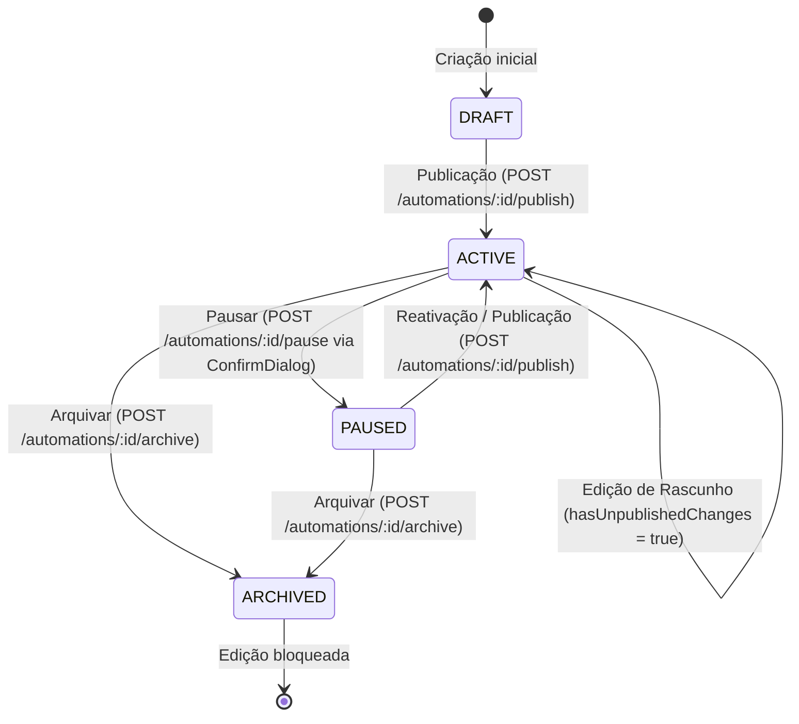

## Parent

PRD `docs/prds/automation-configuration-management.md`; cobre a User Story 5 e 6 (pausa de automações ativas e edição de rascunhos sem afetar a versão publicada).

## What to build

Implementar controle de pausa e ciclo de vida de edições em automações ativas:
1. Ação de pausar na listagem e na tela de revisão (`POST /automations/:id/pause`) com modal de confirmação usando `ConfirmDialog` existente no Engancha.
2. Suporte na UI para automações em estado `ACTIVE` com rascunho em edição (`hasUnpublishedChanges`), com badge e indicação clara no editor de que a versão publicada continua intacta até nova publicação.
3. Tratamento para bloquear edição caso a automação esteja em estado `ARCHIVED` (`AUTOMATION_ARCHIVED`).
4. Atualização imediata do cache de detalhe e listagem após pausa ou republicação.

## Acceptance criteria

- [x] Automação em estado `ACTIVE` pode ser pausada via diálogo de confirmação (`POST /automations/:id/pause`).
- [x] Automações `PAUSED` não oferecem ação de pausar novamente.
- [x] Editar uma automação ativa exibe aviso/badge de `hasUnpublishedChanges` sem alterar a versão ativa até a publicação explícita.
- [x] Tentativa de editar automação arquivada exibe bloqueio e mensagem informativa.
- [x] Testes no DOM com Vitest Browser cobrindo confirmação de pausa, atualização de badges e ciclo de edição com rascunho não publicado.
- [x] A seção `Result` documenta o comportamento entregue, Diagrama Mermaid caso aplicável, os principais arquivos ou contratos, Responsabilidade de cada arquivo, explicações sobre conceitos (caso aplicável e necessário), decisões e limites relevantes e as validações executadas.

## Blocked by

- docs/tickets/automation-configuration-management/009-etapa-revisao-e-publicacao.md

## Result

### Comportamento Entregue

1. **Pausa de automações ativas com confirmação segura**:
   - Integrado `useAutomationMutations.pauseAutomation` com chamada a `POST /automations/:id/pause`.
   - Incluído botão/ação "Pausar" tanto no menu de linha da tabela (`AutomationRowActions`) quanto na barra de publicação da tela de revisão (`AutomationReviewPublishBar`).
   - Ambas as ações exigem confirmação explícita através do componente padrão `ConfirmDialog`.
   - Automações em estado `PAUSED` e `ARCHIVED` não exibem mais a opção de pausa.

2. **Edição de rascunhos em automações ativas (`hasUnpublishedChanges`)**:
   - O cabeçalho do editor exibe o badge contextual `AutomationStatusBadge` com a flag `hasUnpublishedChanges` ("Alterações pendentes").
   - `AutomationEditorLayoutView` exibe um banner informativo em destaque alertando que a versão anterior em execução continua respondendo no Instagram até que uma nova versão seja publicada.
   - A barra de publicação na revisão ajusta dinamicamente rótulos e mensagens para "Republicar automação" / "Publicar alterações" / "Reativar automação".

3. **Bloqueio de edição para automações arquivadas (`ARCHIVED`)**:
   - `AutomationEditorLayoutView` intercepta automações com `status === 'ARCHIVED'` e renderiza uma tela de bloqueio dedicada informando que a automação foi arquivada e não pode mais ser editada, com botão de retorno à listagem.
   - O menu de linha da tabela de listagem oculta a ação "Editar" para automações arquivadas.

### Diagrama de Ciclo de Vida e Estados

### Arquivos e Responsabilidades

- [`apps/web/src/features/automations/hooks/use-automation-mutations.ts`](file:///home/luis/Documentos/Git/Engancha/apps/web/src/features/automations/hooks/use-automation-mutations.ts): Adicionada mutation `pauseAutomation` que atualiza atomicamente o cache de detalhe e invalida listagens.
- [`apps/web/src/features/automations/components/automation-row-actions.tsx`](file:///home/luis/Documentos/Git/Engancha/apps/web/src/features/automations/components/automation-row-actions.tsx): Integração da ação de pausa com `ConfirmDialog` e restrição de edição em automações arquivadas.
- [`apps/web/src/features/automations/components/automation-review-publish-bar.tsx`](file:///home/luis/Documentos/Git/Engancha/apps/web/src/features/automations/components/automation-review-publish-bar.tsx): Suporte a botão de pausa e mensagens contextuais para `ACTIVE`, `PAUSED` e rascunhos não publicados.
- [`apps/web/src/features/automations/views/automation-editor-layout-view.tsx`](file:///home/luis/Documentos/Git/Engancha/apps/web/src/features/automations/views/automation-editor-layout-view.tsx): Banner de `hasUnpublishedChanges` e tela de bloqueio para automações arquivadas.
- [`apps/web/src/features/automations/views/review-step-view.tsx`](file:///home/luis/Documentos/Git/Engancha/apps/web/src/features/automations/views/review-step-view.tsx): Suporte ao modal de confirmação de pausa dentro do fluxo de revisão.

### Validações Executadas

- Testes de mutação: `use-automation-mutations.test.tsx` (100% passando).
- Testes da listagem com pausa e restrições: `automations-list-view.test.tsx` (5/5 passando).
- Testes do editor e bloqueios: `automation-editor-layout-view.test.tsx` (5/5 passando).
- Testes de revisão e publicação: `review-step-view.test.tsx` (7/7 passando).
