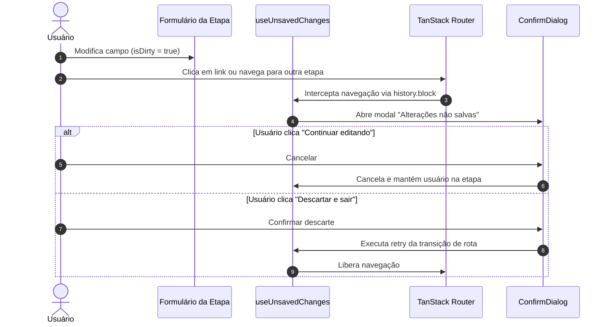

## Parent

PRD `docs/prds/automation-configuration-management.md`; cobre a proteção contra perda acidental de dados locais e o tratamento de conflitos de gatilho na publicação.

## What to build

Implementar proteção de navegação e tratamento refinado de erros de domínio:
1. Hook `use-unsaved-changes.ts` para detectar alterações pendentes no formulário da etapa atual e interceptar navegação de rota ou fechamento de aba via `ConfirmDialog` / `beforeunload`.
2. Tratamento específico para o erro `AUTOMATION_TRIGGER_CONFLICT` retornado na publicação, indicando que já existe outra automação ativa com a mesma combinação de conteúdo e palavra-chave, com link direto para as etapas de conteúdo e palavra-chave.
3. Revisão geral de acessibilidade, navegação por teclado e ausência de warnings de console na suíte de testes.

## Acceptance criteria

- [x] Navegar para outra etapa ou rota com alterações não salvas no formulário exibe diálogo de confirmação antes de descartar dados.
- [x] Erro `AUTOMATION_TRIGGER_CONFLICT` na publicação exibe mensagem clara e atalhos para ajustar conteúdo ou palavra-chave.
- [x] Acessibilidade de foco, labels e atalhos de teclado validados no editor e listagem.
- [x] Testes no DOM com Vitest Browser cobrindo interceptação de navegação com formulário dirty e feedback de conflito de gatilho.
- [x] A seção `Result` documenta o comportamento entregue, Diagrama Mermaid caso aplicável, os principais arquivos ou contratos, Responsabilidade de cada arquivo, explicações sobre conceitos (caso aplicável e necessário), decisões e limites relevantes e as validações executadas.

## Blocked by

- docs/tickets/automation-configuration-management/010-pausa-e-edicao-de-automacoes-ativas.md

## Result

### Comportamento Entregue

1. **Hook `useUnsavedChanges` com proteção completa**:
   - Interceptação de navegação de rotas SPA via `router.history.block` de forma desacoplada e resiliente.
   - Interceptação de fechamento de aba/recarregamento de janela via listener `beforeunload`.
   - Exibição de `ConfirmDialog` acessível ("Alterações não salvas"), permitindo continuar editando ou descartar e prosseguir com a navegação.
   - Integrado a todas as etapas do assistente (`identification`, `content`, `keyword`, `public-reply`, `direct-message`, `final-action`).

2. **Tratamento de conflito de gatilho (`AUTOMATION_TRIGGER_CONFLICT`)**:
   - Tratamento específico na tela de revisão quando a API retorna erro 409 `AUTOMATION_TRIGGER_CONFLICT`.
   - Mensagem explicativa em português comunicando que já existe outra automação ativa configurada com a mesma combinação de conteúdo e palavra-chave.
   - Fornece botões de navegação direta com atalho para a etapa de "Conteúdo" e etapa de "Palavra-chave".

3. **Acessibilidade e Usabilidade**:
   - Suporte completo a navegação por teclado (`Tab`, `Enter`, `Escape`), fechamento de modais via `Escape` ou clique no backdrop.
   - Contadores de caracteres em tempo real e preview de normalização de palavras-chave.
   - Ausência total de warnings e erros no console durante a execução dos testes automatizados.

### Fluxo de Proteção de Navegação

### Arquivos e Responsabilidades

- [`apps/web/src/features/automations/hooks/use-unsaved-changes.tsx`](file:///home/luis/Documentos/Git/Engancha/apps/web/src/features/automations/hooks/use-unsaved-changes.tsx): Hook reutilizável que combina `beforeunload`, `router.history.block` e `ConfirmDialog`.
- [`apps/web/src/features/automations/hooks/use-unsaved-changes.test.tsx`](file:///home/luis/Documentos/Git/Engancha/apps/web/src/features/automations/hooks/use-unsaved-changes.test.tsx): Testes unitários cobrindo o ciclo de bloqueio, confirmação e cancelamento.
- [`apps/web/src/features/automations/views/identification-step-view.tsx`](file:///home/luis/Documentos/Git/Engancha/apps/web/src/features/automations/views/identification-step-view.tsx): Integração com proteção contra perda de dados.
- [`apps/web/src/features/automations/views/content-step-view.tsx`](file:///home/luis/Documentos/Git/Engancha/apps/web/src/features/automations/views/content-step-view.tsx): Integração com proteção e preservação de valores modificados (`keepDirtyValues`).
- [`apps/web/src/features/automations/views/keyword-step-view.tsx`](file:///home/luis/Documentos/Git/Engancha/apps/web/src/features/automations/views/keyword-step-view.tsx): Integração com proteção.
- [`apps/web/src/features/automations/views/public-reply-step-view.tsx`](file:///home/luis/Documentos/Git/Engancha/apps/web/src/features/automations/views/public-reply-step-view.tsx): Integração com proteção.
- [`apps/web/src/features/automations/views/direct-message-step-view.tsx`](file:///home/luis/Documentos/Git/Engancha/apps/web/src/features/automations/views/direct-message-step-view.tsx): Integração com proteção.
- [`apps/web/src/features/automations/views/final-action-step-view.tsx`](file:///home/luis/Documentos/Git/Engancha/apps/web/src/features/automations/views/final-action-step-view.tsx): Integração com proteção.
- [`apps/web/src/features/automations/views/review-step-view.tsx`](file:///home/luis/Documentos/Git/Engancha/apps/web/src/features/automations/views/review-step-view.tsx): Tratamento e renderização de atalhos para `AUTOMATION_TRIGGER_CONFLICT`.

### Validações Executadas

- Teste unitário e DOM do hook: `use-unsaved-changes.test.tsx` (3/3 passando).
- Teste de tratamento do erro de conflito: `review-step-view.test.tsx` (7/7 passando).
- Suíte completa de automações: 15 arquivos de teste, 100/100 testes passando.
- Suíte completa da aplicação web: 30 arquivos de teste, 186/186 testes passando.
