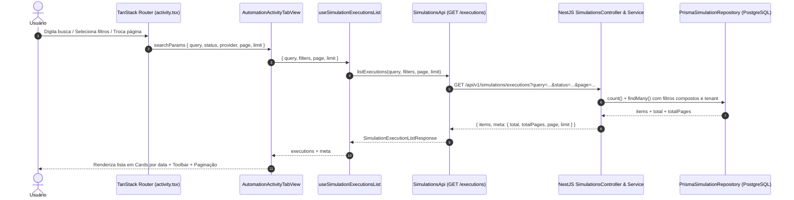

## Parent

PRD `docs/prds/end-to-end-simulation.md`; aprimora a experiência da aba de atividade (`FR-SIM-007`, `FR-SIM-008`, User Stories 6 e 7) adicionando capacidades de busca textual, filtragem facetada multidimensional e paginação, preservando integralmente o layout visual de lista em cards/timeline agrupados por data.

## What to build

Implementar busca textual, filtros facetados em objeto estruturado (`ActivityFilters`), busca textual dedicada (`query`) e controle de paginação na aba de atividade da automação sem converter a interface em tabela tabular:

1. **Tipagem e Contratos (`@engancha/contracts` e `features/automations`)**:
   - Definir objeto tipado `ActivityFilters` para os filtros facetados categóricos:
     ```ts
     export interface ActivityFilters {
       status?: ExecutionStatus[]
       provider?: ContentProvider[]
       mode?: ContentMode[]
       contentType?: ContentType[]
       outputType?: AutomationExecutionOutputType[]
     }
     ```
   - Separar o parâmetro de busca textual rápida: `query?: string` (busca em autor, texto do comentário ou título da publicação).
   - Atualizar `simulationExecutionListQuerySchema` para aceitar `query`, `status`, `provider`, `mode`, `contentType`, `outputType`, `page` e `limit` de forma normalizada (com coerção de valor único para array quando aplicável).
   - Enriquecer `simulationExecutionListResponseSchema` com metadados de paginação (`page`, `limit`, `total`, `totalPages`, `hasMore`, `nextCursor`).

2. **Backend API (`apps/api`)**:
   - Atualizar endpoint `GET /api/v1/simulations/executions` e `PrismaSimulationRepository.list` para:
     - Aplicar filtros compostos do objeto `ActivityFilters` com `where` tipado no Prisma;
     - Aplicar busca textual case-insensitive `query` em `inputAuthor`, `inputText` ou `content.title`;
     - Manter estrito isolamento multi-tenant pelo `organizationId` do workspace ativo;
     - Retornar contagem total e fatiamento paginado correspondente.

3. **Frontend Web (`apps/web`)**:
   - Criar barra de ferramentas de filtros (`AutomationActivityToolbar`) recebendo:
     - `query?: string` e `onQueryChange: (query?: string) => void`
     - `filters: ActivityFilters` e `onFiltersChange: (filters: ActivityFilters) => void`
     - `onReset: () => void`
     reaproveitando os padrões de `DataTableFacetedFilter`, `Input` de busca e botão de `Reset`.
   - Manter a renderização dos itens em cards agrupados temporalmente por data (`AutomationActivityList` e `AutomationActivityItem`), sem utilizar tags `<table>` ou linhas de tabela.
   - Adicionar barra de paginação (`DataTablePagination` ou componente de paginação adaptado para listas) ao final da visualização.
   - Sincronizar `query`, `filters`, página e limite na URL via roteador TanStack Router (`validateSearch` na rota `/automations/$automationId/activity`).
   - Atualizar o hook `useSimulationExecutionsList` gerenciando `{ query, filters, pagination }`, repassando parâmetros ao backend e preservando o fluxo de updates em tempo real via SSE e ação de retry.
   - Adicionar estado vazio contextual quando nenhum resultado for encontrado com os filtros ou busca aplicados ("Nenhuma atividade encontrada com os filtros selecionados") com botão para limpar filtros e busca.

4. **Testes**:
   - Testes de integração na API NestJS para `GET /api/v1/simulations/executions` validando busca textual `query`, filtros facetados `ActivityFilters`, paginação e isolamento por workspace.
   - Testes no DOM com Vitest Browser em `AutomationActivityTabView` cobrindo digitação na busca, seleção nos filtros facetados, navegação de páginas, reset e preservação do layout em cards/timeline.

## Acceptance criteria

- [x] Objeto tipado `ActivityFilters` encapsula os filtros facetados categóricos (`status`, `provider`, `mode`, `contentType`, `outputType`), mantendo `query` como parâmetro de busca textual dedicado.
- [x] Campo de busca permite pesquisar por autor do comentário, texto do comentário ou título da publicação.
- [x] Filtros facetados suportam seleção de status (`COMPLETED`, `PROCESSING`, `PENDING`, `IGNORED`, `FAILED`), provedor/plataforma (`INSTAGRAM`, `TIKTOK`), modo (`SIMULATED`, `REAL`), tipo de conteúdo (`POST`, `VIDEO`) e tipo de ação entregue (`PUBLIC_REPLY`, `PRIVATE_REPLY`, `LINK_DELIVERY`, `EMAIL_CAPTURE_REQUEST`).
- [x] A exibição de atividades preserva o layout de lista em cards/timeline agrupados por data (`Hoje`, `Ontem`, datas anteriores), sem conversão em linhas de tabela HTML.
- [x] Componente de paginação exibe página atual, total de páginas, seletor de quantidade por página e botões de navegação.
- [x] Estado de `query`, `filters` e paginação é serializado e sincronizado na URL do navegador.
- [x] Botão de reset restaura `query` e `filters` para o estado inicial vazio.
- [x] Backend filtra registros respeitando estritamente o isolamento multi-tenant do workspace ativo.
- [x] Atualizações em tempo real via SSE e ação de reprocessamento (retry) em falhas continuam funcionando de forma resiliente com filtros aplicados.
- [x] Testes de integração na API e testes de DOM no Vitest Browser cobrindo busca, filtros, paginação e renderização da lista.
- [x] A seção `Result` documenta o comportamento entregue, Diagrama Mermaid caso aplicável, os principais arquivos ou contratos, Responsabilidade de cada arquivo, explicações sobre conceitos (caso aplicável e necessário), decisões e limites relevantes e as validações executadas.

## Result

### Comportamento Entregue

A aba de atividades da automação (`/automations/:automationId/activity`) agora oferece uma experiência completa de consulta e auditoria:
1. **Busca Textual Dedicada (`query`)**: Busca instantânea por autor do comentário (`inputAuthor`), texto do comentário (`inputText`) ou título da publicação monitorada (`content.title`).
2. **Filtros Facetados Estruturados (`ActivityFilters`)**:
   - `status`: Seleção múltipla de status (`COMPLETED`, `PROCESSING`, `PENDING`, `IGNORED`, `FAILED`).
   - `provider`: Plataforma (`INSTAGRAM`, `TIKTOK`).
   - `mode`: Ambiente (`SIMULATED`, `REAL`).
   - `contentType`: Tipo de conteúdo (`POST`, `VIDEO`).
   - `outputType`: Tipo de resposta entregue (`PUBLIC_REPLY`, `PRIVATE_REPLY`, `LINK_DELIVERY`, `EMAIL_CAPTURE_REQUEST`).
3. **Paginação Integrada para Lista de Cards**:
   - Exibição de total de itens e páginas calculados no backend.
   - Seletor de limite por página (`10`, `20`, `30`, `40`, `50`).
   - Controles de primeira, anterior, numeração direta, próxima e última página.
4. **Preservação de Layout Visual em Cards/Timeline**: A visualização de execuções permanece em formato de timeline agrupada temporalmente por data (`Hoje`, `Ontem`, data completa) com cards expansíveis e detalhes de jornada, sem conversão para `<table>` HTML.
5. **Sincronização Bidirecional com a URL**: Todas as alterações de busca, filtros e paginação são refletidas nos query params via TanStack Router (`validateSearch`), suportando navegação de histórico e compartilhamento de links filtrados.
6. **Resiliência e Tempo Real**: Updates via SSE e reprocessamento sob demanda (retry) funcionam harmoniosamente com os filtros aplicados.

### Diagrama de Arquitetura e Fluxo de Dados



### Principais Arquivos e Responsabilidades

- [`packages/contracts/src/index.ts`](file:///home/luis/Documentos/Git/Engancha/packages/contracts/src/index.ts): Define `contentProviderSchema`, `contentModeSchema`, `contentTypeSchema`, `simulationExecutionListQuerySchema` (com coerção para arrays e defaults) e `simulationExecutionListResponseSchema` (com objeto `meta` de paginação).
- [`apps/api/src/modules/simulations/domain/ports/simulation.repository.ts`](file:///home/luis/Documentos/Git/Engancha/apps/api/src/modules/simulations/domain/ports/simulation.repository.ts): Interface de repositório com parâmetros expandidos de busca, filtros e retorno de metadados.
- [`apps/api/src/modules/simulations/infrastructure/persistence/prisma-simulation.repository.ts`](file:///home/luis/Documentos/Git/Engancha/apps/api/src/modules/simulations/infrastructure/persistence/prisma-simulation.repository.ts): Cláusulas `where.AND` compostas no Prisma com isolamento multi-tenant por `organizationId`, busca textual case-insensitive e contagem `count()`.
- [`apps/api/src/modules/simulations/application/simulations.service.ts`](file:///home/luis/Documentos/Git/Engancha/apps/api/src/modules/simulations/application/simulations.service.ts): Aplicação de regras e montagem do retorno tipado com metadados.
- [`apps/web/src/features/automations/data/activity-filter-options.ts`](file:///home/luis/Documentos/Git/Engancha/apps/web/src/features/automations/data/activity-filter-options.ts): Opções e labels para os filtros facetados e tipagem de `ActivityFilters`.
- [`apps/web/src/features/automations/components/automation-activity-toolbar.tsx`](file:///home/luis/Documentos/Git/Engancha/apps/web/src/features/automations/components/automation-activity-toolbar.tsx): Barra de ferramentas com input de busca, filtros facetados e botão de reset.
- [`apps/web/src/features/automations/components/automation-activity-pagination.tsx`](file:///home/luis/Documentos/Git/Engancha/apps/web/src/features/automations/components/automation-activity-pagination.tsx): Componente de paginação acessível e responsivo para listas em cards.
- [`apps/web/src/features/automations/hooks/use-simulation-executions-list.ts`](file:///home/luis/Documentos/Git/Engancha/apps/web/src/features/automations/hooks/use-simulation-executions-list.ts): Hook reativo integrando queries, filtros, paginação, SSE e ações de reprocessamento.
- [`apps/web/src/features/automations/views/automation-activity-tab-view.tsx`](file:///home/luis/Documentos/Git/Engancha/apps/web/src/features/automations/views/automation-activity-tab-view.tsx): View que reúne Header, Toolbar, Cards de atividade, Paginação e estado vazio para filtros.
- [`apps/web/src/routes/automations/$automationId/activity.tsx`](file:///home/luis/Documentos/Git/Engancha/apps/web/src/routes/automations/$automationId/activity.tsx): Rota com `validateSearch` sincronizando busca e filtros na URL.

### Validações Executadas

- **Testes de Integração API NestJS (`npm run test:simulations:e2e`)**: 20/20 testes aprovados cobrindo busca textual, combinações de múltiplos filtros facetados, metadados de paginação e isolamento entre workspaces.
- **Testes Unitários e DOM Vitest Browser (`npm run web:test`)**: Testes cobrindo renderização da toolbar, input de busca, seleção de filtros facetados, estado vazio filtrado com botão reset, paginação e expansão de jornadas.
- **Checagem de Tipos (`npm run typecheck`)**: 100% de conformidade com TypeScript nos workspaces `@engancha/contracts`, `@engancha/api`, `@engancha/web` e `@engancha/worker`.
- **Lint e Formatação (`npm run lint` & `npm run format:check`)**: Aprovados sem advertências.
- **Atualização do Grafo de Conhecimento**: Executado `graphify update .` com sucesso.

